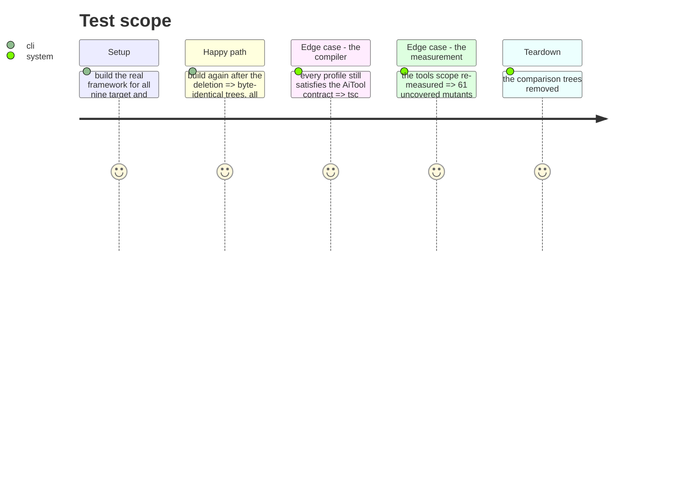

# Instruction: Delete the reverse surface nobody calls

Phase 2 stopped before writing tests because 61 of the 173 mutants it targeted were in code
with no caller. The same search found the pattern is not local to Copilot: an entire reverse
API is declared, implemented in every profile, and used by nothing.

Deleting it is what the project's own rule asks for — a test over it would freeze code that
should not exist and make removing it dearer.

## What is being removed, and the evidence it is dead

| Symbol | Declared in | Implemented in | Production callers |
| ------ | ----------- | -------------- | -----------------: |
| `AiTool.reverseRewriteContent` | `tools/domain/contracts.ts` | 5 profiles | **0** |
| `AiTool.detectUserFileSectionKey` | `tools/domain/contracts.ts` | 5 profiles | **0** |
| `AgentsCapability.reverseConvertFrontmatter` | `capabilities/agents-capability.ts` | 5 profiles wire it | **0** |
| `CommandsCapability.reverseConvertFrontmatter` | `capabilities/commands-capability.ts` | idem | **0** |
| `RulesCapability.reverseConvertFrontmatter` | `capabilities/rules-capability.ts` | idem | **0** |
| `SkillsCapability.reverseConvertFrontmatter` | `capabilities/skills-capability.ts` | idem | **0** |
| `detectSectionKeyFromPrefixes` | `formats/command.ts` | — | **0** |
| `UserFileSectionKey` | `formats/command.ts` | — | only by the two above |

Established three ways: each name searched across `src/` with the declaration and
implementation sites excluded, leaving zero; no bracket access on a tool or config object
exists anywhere in `src/`, so no dynamic dispatch reaches them; and `git log -S` shows no
caller has ever existed under `framework/` or `application/` since the CLI entered this
repository. The symmetry was built, the consumer never was.

`UserFileSection` stays — `install-content-section-use-case.ts` uses it.

## Correction (2026-09-03) — la moitié « placeholders » de cette phase était fausse

Ce qui suit décrit la suppression telle qu'elle a été faite. Une relecture indépendante a montré
qu'une moitié était un défaut, et elle est revenue. La section est gardée telle quelle parce que
le raisonnement qui a conduit à l'erreur vaut plus que sa correction, mais **la réécriture des
placeholders de copilot est restaurée** : voir « Ce que la preuve ne pouvait pas voir ».

## La moitié qui tenait, et celle qui ne tenait pas

The first draft of this phase kept the `{{TOOLS}}` / `{{DOCS}}` rewriting on the grounds that
it is called even if nothing feeds it. That was too cautious, and `placeholders.ts` said so in
its own comment:

> Placeholder substitution removed in marketplace-only architecture. Plugin content is
> tool-agnostic with relative paths and hardcoded aidd_docs. Kept as identity for backward
> compat with existing callers; will be removed when capability classes drop docsDir threading.

`baseRewriteContent` was already an identity function for claude, cursor, codex and opencode.
Copilot was the last profile carrying real placeholder logic. The module announced its own
removal and the condition it was waiting for; this phase met the condition.

`docsDir` existed only to feed that substitution. Unwinding it reached the `AiTool` contract,
the five profiles, the content translator, the `PluginTranslator` port and both its
implementations, the install, plugin and restore use-cases, and the commands at the top.
`DOCS_DIR` itself stays — `kanban` reads the task documents from it.

## Architecture projection

> Tree of the final files. ✅ create · ✏️ modify · ❌ delete

```txt
.
└── cli/
    ├── src/contexts/tools/domain/
    │   ├── contracts.ts                          ✏️ two methods off the AiTool contract
    │   ├── formats/command.ts                    ✏️ the helper and the type it returns
    │   ├── capabilities/agents-capability.ts     ✏️ the reverse method and its param
    │   ├── capabilities/commands-capability.ts   ✏️ idem
    │   ├── capabilities/rules-capability.ts      ✏️ idem
    │   ├── capabilities/skills-capability.ts     ✏️ idem
    │   └── profiles/{claude,codex,copilot,cursor,opencode}/profile.ts  ✏️ their implementations
    └── tests/contexts/tools/domain/
        ├── profiles/{codex,cursor,opencode}.unit.test.ts  ✏️ the tests over the deleted methods
        ├── registry-conformance.unit.test.ts              ✏️ the contract conformance rows
        └── tool-config.unit.test.ts                       ✏️ the stub's members
```

## Test Scope



## Tasks to do

### `1)` Take the before-picture first

1. Build the real framework for the five targets in marketplace mode and the five in flat,
   with the current binary. This is the only reference the deletion can be checked against.

### `2)` Remove the surface

1. The two methods from the `AiTool` contract and from all five profiles.
2. `reverseConvertFrontmatter` from the four capability classes and from every profile that
   passes one in.
3. `detectSectionKeyFromPrefixes` and `UserFileSectionKey`. Keep `UserFileSection`.
4. The tests that exist only to exercise the deleted methods.

### `3)` Prove nothing moved

1. Rebuild, build the framework again for all nine pairs, and diff against task 1's trees.
   Deleting code nobody calls cannot change output; a difference means it was called.
2. Full suite, smoke, tsc, biome, knip.

### `4)` Re-measure

1. `pnpm test:mutation:tools` against 61,77 %, and report the delta with its cause: part of it
   is dead mutants leaving the denominator, not tests gaining ground. Say which part.

## Test acceptance criteria

| Task | Acceptance criteria |
| ---- | ------------------- |
| 1 | Ten reference trees exist before a line is deleted |
| 2 | No occurrence of the four names remains in `src/`, and `UserFileSection` still resolves |
| 3 | All nine target/mode builds are byte-identical to their reference; suite, smoke, tsc, biome, knip clean |
| 4 | The `tools` score is re-measured and the delta is attributed, not just quoted |


## Livrée (2026-09-03)

60 fichiers, **803 lignes supprimées pour 147 ajoutées**. Bundle 389,8 => 382,4 Ko.

### Vérifié

| Quoi | Preuve |
| ---- | ------ |
| Aucune sortie n'a bougé | Les neuf couples cible/mode construits avant la première suppression, rejoués après la dernière : identiques octet pour octet, 434 fichiers en marketplace, 425 à 427 en flat |
| La suite | 2 005 tests / 992 suites, 0 échec |
| Les portes | tsc 0, biome 0 avertissement, knip 0, smoke 98 / 0 sur 22 commandes feuilles |

Supprimer du code que personne n'appelle ne peut pas changer la sortie. Une différence aurait
voulu dire qu'il était appelé — c'est le seul contrôle qui vaut ici, et c'est pour cela que la
photo a été prise avant la première ligne supprimée, pas après.

### Ce que la méthode vaut, et ne vaut pas

Le déroulement de `docsDir` a été mécanique, guidé par le compilateur passe après passe sur
une soixantaine de fichiers. C'est une manœuvre où ma relecture ne prouve rien : ce qui prouve,
c'est la sortie identique et la suite verte. Les deux tiennent.

Les dix-huit tests écrits en phase 2 pour épingler la réécriture des placeholders sont partis
avec elle — ils décrivaient exactement ce qui n'existe plus. Il en reste un, qui dit ce qui est
vrai maintenant : le contenu passe inchangé.


## Ce que la preuve ne pouvait pas voir

`aidd plugin install --tool copilot` écrivait `{{TOOLS}}/...` littéralement dans les fichiers
installés. Reproduit sur `tests/fixtures/framework-real`, l'instantané figé d'une release que ce
dépôt embarque :

```
avant : - validator: `.github/plugins/aidd-pm/skills/05-spec/assets/spec-validator.yml`
après  : - validator: `{{TOOLS}}/plugins/aidd-pm/skills/05-spec/assets/spec-validator.yml`
```

Les neuf builds identiques ne pouvaient pas l'attraper, pour trois raisons dont aucune n'était
écrite ici :

1. `aidd translate` n'appelle jamais `rewriteContent`. La réécriture n'existe que sur le chemin
   d'installation, que la comparaison de builds ne touche pas.
2. Le golden ne gèle qu'une cellule — `FROZEN_CELLS = new Set(["claude"])` — et `claude` avait
   déjà l'identité pour `rewriteContent`. La seule cellule comparée octet à octet était
   structurellement incapable d'attraper un changement propre à copilot.
3. Les plugins livrés aujourd'hui ne portent aucun placeholder, donc l'échantillon ne pouvait pas
   déclencher le défaut. L'exposition est ailleurs : les releases épinglées plus anciennes et les
   plugins tiers.

L'erreur de raisonnement tient en une phrase : « pas déclenché par mon échantillon » a été écrit
comme « pas appelé ». La phase 2 avait pourtant fait la distinction, explicitement, et la phase 3
l'a effacée sans la traiter.

`rewriteCopilotContent`, `resolveInstalledPath` et les quatre constantes sont revenus, avec
`DOCS_DIR` importé du noyau plutôt que le paramètre `docsDir` déroulé — il valait cette constante
à chaque site d'appel, ce que le déroulement a confirmé.

### Vérifié sur le bon chemin, cette fois

| Quoi | Preuve |
| ---- | ------ |
| L'installation ne bouge pas | `setup` puis `plugin install aidd-dev` pour les cinq outils, binaire d'avant contre binaire d'après : identiques — copilot 246 fichiers, claude 248, codex 48, opencode 46, cursor 5. Seuls les horodatages de `marketplaces.json` diffèrent |
| La régression est épinglée | Re-supprimée, 13 tests échouent, dont un au niveau du traducteur — la chaîne exacte que suit `plugin install` |
| La ligne qui a régressé est un cas de test | `validator: \`{{TOOLS}}/plugins/…\`` est écrit tel quel dans `copilot.unit.test.ts` |
| Les portes | 2 018 tests / 996 suites, tsc 0, biome 0, knip 0 |

## Le score, et son attribution

`tools` passe de **61,04 % à 63,95 %**, mesuré par `pnpm test:mutation:tools`. Deux causes, et
elles ne se séparent pas proprement parce qu'elles ont atterri ensemble :

- **Le dénominateur a rétréci** : 2 859 mutants avant, 2 613 après. Les 246 disparus étaient dans
  du code supprimé, donc aucun n'était tué. Retirer des mutants non tués monte le score sans
  qu'un test gagne un pouce de terrain.
- **La couverture a gagné** : `copilot/profile.ts` passe de 173 mutants sans couverture à 20,
  grâce aux tests de réécriture restaurés.

Prétendre à un partage chiffré entre les deux serait une précision inventée. Ce qui est vrai :
une partie de ces trois points est du code en moins, pas du test en plus.

## Ce que cette phase laisse au dépôt

Le golden ne gèle qu'une cible sur neuf. Les huit autres sont recapturées à chaque re-baseline,
donc une régression propre à copilot, cursor, codex ou opencode ne fait échouer personne. Ce
n'est pas corrigé ici — c'est un choix qui appartient à qui décide du coût des re-baselines — mais
c'est le trou par lequel ce défaut est passé, et il reste ouvert.
