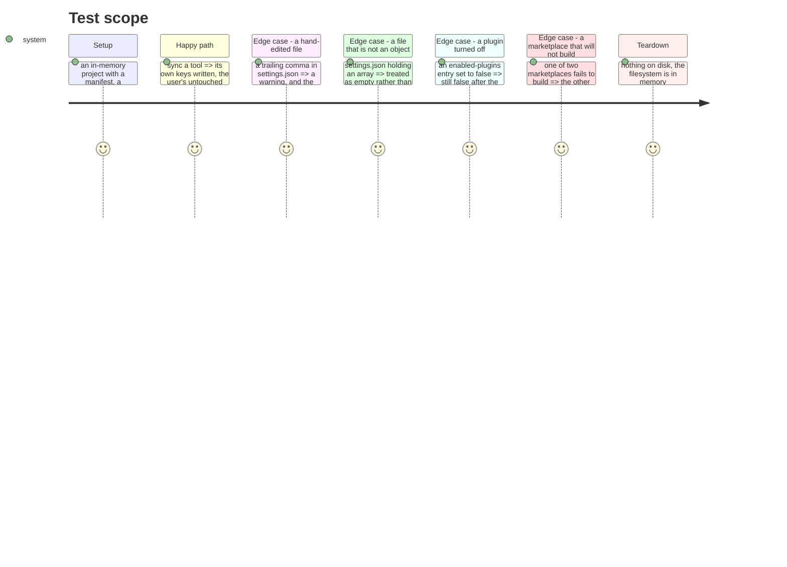

# Instruction: The marketplace sync, where a user's own file is at stake

`marketplace-sync-settings-use-case.ts` carries 100 mutants no unit or integration test
executes, of 331. It is the flow that writes into files the user also edits — the tool's
`settings.json`, its machine-local registration, its enabled-plugins map — so a regression
here does not fail loudly, it quietly rewrites somebody's file.

## What the measurement says, function by function

Ranked by what is reachable, because that is the distinction the last two phases turned on.

| Function | Mutants | Killed | Reachable today |
| -------- | ------: | -----: | --------------- |
| `mergeMarketplaces` + `…Array` + `…Map` | 57 | **0** | **no** — see below |
| `existingArray` | 10 | **0** | **no** — only called from the merge |
| `resolveSourceForSettings` | 8 | **0** | **no** — idem |
| `loadSettings` | 19 | 3 | yes, from two of its three call sites |
| `builtSourcesForTool` | 7 | **0** | yes, before the branch that stops |
| `existingRecord` | 13 | 7 | yes, from `mergeEnabledPlugins` |
| `nativeActivationBinary` | 10 | 5 | yes |
| `mergeEnabledPlugins` | 34 | 23 | yes |

## The 75 mutants nothing can reach, and why that is not the last phase's finding again

`syncMarketplacesFile` stops before the merge whenever the tool declares a native plugin
CLI or no marketplace file of its own:

```ts
if (settings.marketplacesSettingsPath === null || nativeActivationOf(toolId) !== undefined) {
  return this.evictMarketplacesFromSharedFile(toolId, projectRoot, manifest, settings);
}
```

Checked by execution, not by reading — the five registered profiles were run through that
condition:

| Tool | `marketplacesSettingsPath` | native CLI | reaches the merge |
| ---- | ------------------------- | ---------- | ----------------- |
| claude | `.claude/settings.local.json` | yes | no |
| copilot | `null` | yes | no |
| codex | none | yes | no |
| cursor | none | no | no |
| opencode | none | no | no |

**This is not the reverse API.** That had no caller at all and never had one. This has a
live call site, and a branch that no shipped profile takes. Phase 5 of the context refactor
made "drive the tool's own command where it offers one" the rule, and all three plugin-capable
tools gained a `nativeActivation` then; this merge is the path that rule superseded. A profile
that dropped its `nativeActivation` tomorrow would make it live again the same day.

**What this phase cannot see:** whether a tool without a plugin CLI is coming. The
`MarketplaceSettings` contract still carries both an array and a map shape, which is design
for tools that do not exist yet. So the question — retire the merge, or keep it as the
fallback for a tool that offers no CLI — is not answered by a mutation report, and this phase
does not answer it. It writes no test there: a test would freeze a path pending a decision,
which is what phase 2 refused to do and phase 3 got wrong.

## Architecture projection

> Tree of the final files. ✅ create · ✏️ modify · ❌ delete

```txt
.
└── cli/
    └── tests/contexts/framework/application/flows/
        └── marketplace-sync-settings.unit.test.ts     ✅ create
```

No production file changes.

## What is covered, and what breaks for a user

| Behaviour | What breaks if it regresses |
| --------- | --------------------------- |
| A settings file holding malformed JSON is warned about and treated as empty | The whole sync throws on a file the user hand-edited — `setup`, `sync` and `update` all fail, and the message names JSON rather than the file |
| A settings file that parses to an array or `null` is treated as empty | Garbage spreads into the merge and lands in the user's settings |
| A file that is absent is treated as empty, not as an error | First sync on a fresh project fails |
| `existingRecord` keeps what is already under the key | A user's own enabled-plugins entries are dropped on the next sync |
| A plugin the user disabled stays disabled | Sync silently re-enables a plugin somebody turned off |
| A marketplace whose build fails is left out of the built-source map, and the others still sync | One unbuildable marketplace takes the whole sync down, or worse, its registration points at a directory that was never built |
| The activator is picked by the binary the profile declares | The wrong tool's CLI is driven, or none is |

## Test Scope



## Tasks to do

### `1)` Cover what a user's own file is exposed to

1. `loadSettings` through `execute`: absent, malformed, array, null, and an object that
   parses. The malformed case must show the warning and leave the sync standing.
2. `existingRecord` through `mergeEnabledPlugins`: an entry already present, an entry set to
   `false`, and a value under the key that is not an object.

### `2)` Cover the build that happens whatever the tool

1. `builtSourcesForTool` has seven mutants and no test kills one. Two marketplaces, one that
   builds and one that does not, and the sync still reports the tool.

### `3)` Say what is not covered, and why

1. Record the 75 unreachable mutants with the table above, and leave the retire-or-keep
   question to whoever owns the tool profiles.
2. Re-measure `framework` against 66,10 % and attribute the delta.

## Test acceptance criteria

| Task | Acceptance criteria |
| ---- | ------------------- |
| 1 | A malformed settings file warns and does not throw; a non-object is treated as empty; a disabled plugin stays disabled |
| 2 | A failing build leaves its marketplace out and the sync still completes for the rest |
| 3 | The unreachable block is recorded with the execution that establishes it, and no test is written against it |
| all | Suite green with the ratios equal, tsc 0, biome 0, knip 0 |

## Livrée (2026-09-03)

Neuf tests sur le fichier que l'utilisateur édite aussi. `framework` passe de 66,10 % à
**66,67 %** ; dans ce fichier, 143 mutants tués deviennent 166 et 100 sans couverture
deviennent 92. Le gain global est petit parce que le scope compte 4 110 mutants et que cette
phase touche un fichier ; le gain local est celui qui compte.

### Trois régressions réinjectées, les trois attrapées

| Injection | Test qui tombe |
| --------- | -------------- |
| `loadSettings` relance au lieu d'avertir | un fichier mal formé fait échouer `setup`, `sync` et `update` |
| `mergeEnabledPlugins` écrase au lieu d'ignorer | **un plugin désactivé par l'utilisateur est réactivé en silence** |
| `buildForTool` relance au lieu de sauter | une marketplace qui ne compile pas arrête la synchronisation des autres |

La deuxième est la plus coûteuse et tient à une ligne :
`if (!(key in existing)) toAdd[key] = true`. Entre respecter un choix et le défaire à chaque
synchronisation, il y a ce test d'appartenance.

### Ce qui reste non couvert, et pourquoi aucun test n'est écrit dessus

Les 75 mutants de `mergeMarketplaces`, `mergeMarketplacesArray`, `mergeMarketplacesMap`,
`existingArray` et `resolveSourceForSettings` sont dans une branche qu'aucun profil livré ne
prend, établi en exécutant la condition sur les cinq. Écrire un test là figerait un chemin en
attente d'une décision — retirer ou garder — qui appartient à qui possède les profils.

Cette décision est prise dans `2026_09_03_registration-native/`.
