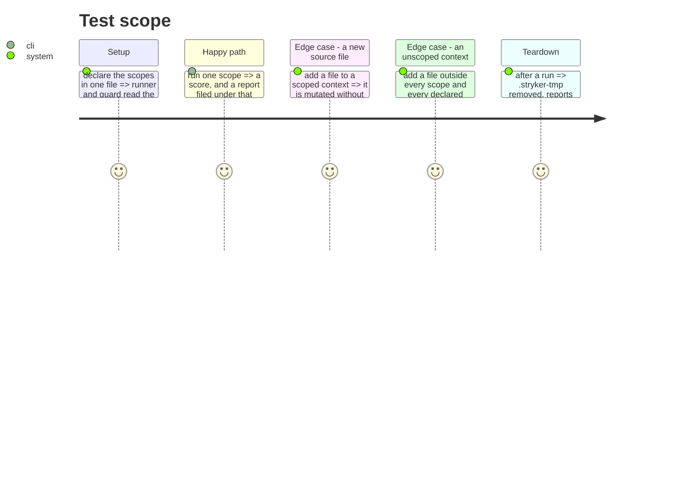

# Instruction: Declare the scopes, run them, and check nothing escapes

## Architecture projection

> Tree of the final files. ✅ create · ✏️ modify · ❌ delete

```txt
.
└── cli/
    ├── mutation-scopes.json                          ✅ create (the one declaration)
    ├── stryker.conf.json                             ✏️ modify (no file list, per-scope reports)
    ├── package.json                                  ✏️ modify (one script per scope)
    ├── scripts/
    │   └── run-mutation.mjs                          ✅ create (reads the declaration, files the report)
    ├── tests/architecture/
    │   └── mutation-covers-source.arch.test.ts       ✅ create
    └── aidd_docs/memory/testing.md                   ✏️ modify (how to run one, what the numbers are)
```

## Test Scope



## Tasks to do

### `1)` Declare the scopes once

1. `mutation-scopes.json`: each scope maps a name to its glob, plus an `excluded` map giving
   a reason per directory left out. Both halves are read by the guard.
2. `stryker.conf.json` drops its seventeen-file `mutate` list; the scope arrives per run.

### `2)` Run a scope by name

1. `scripts/run-mutation.mjs <scope>`: looks the scope up, runs stryker with `--mutate <glob>`,
   files the html and json reports under `reports/mutation/<scope>/`, and removes `.stryker-tmp`.
   Without an argument it lists the scopes.
2. `package.json`: `test:mutation` keeps working and names what to pass; one script per scope.

### `3)` Check that nothing escapes

1. `tests/architecture/mutation-covers-source.arch.test.ts`: every `.ts` under `src/` matches a
   scope glob or sits under a declared exclusion. A file in neither fails, naming it.
2. Prove it by adding a synthetic file outside every scope and watching it fail.

### `4)` Confirm or correct the numbers on record

1. Run every scope. Record the score each one actually produces.
2. The context refactor's `plan.md` and `phase-10.md` quote five scores from runs nobody kept.
   Where a reproducible run disagrees, correct the document and say the earlier figure was
   unreproducible — do not leave a number standing that no command produces.

## Test acceptance criteria

| Task | Acceptance criteria |
| ---- | ------------------- |
| 1 | The scope globs and the exclusions are in one file, and nothing else in the repo lists them |
| 2 | `node scripts/run-mutation.mjs kernel` prints a score and leaves `reports/mutation/kernel/`; a second scope leaves its own directory without overwriting the first |
| 3 | A synthetic file outside every scope fails the new test by name; removing it makes it pass |
| 4 | Every quoted score in `aidd_docs/` is one a committed command reproduces, or is marked as corrected |
| all | 1990 tests over 986 suites, knip clean, tsc 0, biome 0 |

## Livrée (2026-09-03)

Deux choses que la fiche n'avait pas prévues.

**Le traducteur de glob du test avait le bug qu'il devait empêcher.** `src/kernel/**/*.ts` ne
matchait pas `src/kernel/errors.ts` : `**` était traduit sans le cas « zéro répertoire ». Un
scope n'aurait couvert que ses sous-dossiers, et les fichiers à la racine du contexte auraient
échappé à la mutation sans que rien ne le dise — exactement le défaut que cette phase corrige.
Attrapé par les cas de la règle elle-même, avant tout run.

**Les anciens chiffres mesuraient la couche `domain/` seule.** `phase-20.md` le dit dans sa
colonne « cible », mais aucune commande gardée ne les reproduisait, et lus sans cette colonne
ils passent pour le score d'un contexte entier. Les deux documents qui les citent portent
maintenant la correction. Le scoping `domain/` seul aurait d'ailleurs échoué au nouveau test :
tous les fichiers `application/` et `infrastructure/` seraient tombés hors de tout scope et
hors de toute exclusion.

## Vérifié

| Critère | Preuve |
| ------- | ------ |
| 2 | Les cinq scopes tournent, chacun laisse `reports/mutation/<scope>/` ; aucun n'écrase le précédent |
| 3 | `src/orphan/thing.ts` hors de tout scope => échec nommant le fichier ; retiré, le test repasse |
| 3 | `mutate` remis dans `stryker.conf.json` => `stryker.conf.json declares its own mutate again` |
| 4 | Les cinq chiffres du dossier sont corrigés avec leur périmètre, et chacun est reproductible par `pnpm test:mutation:<scope>` |
| all | 1 994 tests / 988 suites · tsc 0 · biome 0 · knip exit 0 |


## Revue (2026-09-03)

Sept défauts trouvés par une relecture indépendante, dont un qui vidait la phase de son sens.

**L'exclusion de `presentation` et `runtime` reposait sur une raison fausse.** Elle affirmait que
leur preuve était e2e et la smoke, qu'aucun mutant n'atteint. Mesuré : 31 tests unitaires et
d'intégration visent ces deux répertoires, zéro test e2e n'y est écrit, et
`runtime/self-update/check-update-use-case.ts` est 66 lignes de branchement avec son propre test
unitaire. La garde n'exigeait d'une exclusion qu'une raison de plus de quarante caractères, pas
qu'elle soit vraie. Les deux sont devenus des scopes ; seule `src/cli.ts` reste exclue.

**Les rapports étaient copiés dans le bac à sable.** Les déplacer sous `reports/mutation/<scope>/`
les a sortis du chemin que `stryker.conf.json` déclarait, donc chaque run recopiait les rapports
des précédents. Mesuré : 1 091 fichiers projet avec les rapports présents, 1 081 sans.
`ignorePatterns: ["reports"]` ramène à 1 081 rapports présents.

**Les noms de scopes étaient une deuxième liste.** Déclarés dans `mutation-scopes.json`, recopiés
à la main dans sept scripts `package.json`. Le test compare désormais les deux ensembles :
supprimer un script fait échouer en le nommant.

**`"constructor" in SCOPES` était vrai.** `node scripts/run-mutation.mjs constructor` prenait le
chemin heureux et lançait Stryker avec `--mutate 'function Object() { [native code] }'`.
`Object.hasOwn`.

**Trois formulations trop fortes, corrigées :** « code qu'aucun test n'exécute » devient « aucun
test unitaire ou d'intégration » — la mesure écarte e2e et architecture ; le message de commit dit
cinq cibles `domain/` là où les documents disent quatre, et quatre est juste, `kernel` ayant
toujours été mesuré en entier ; et le seuil `break: 50` contredisait « jamais bloquante » en
faisant sortir `presentation` en erreur, il est retiré.

## Vérifié après revue

| Quoi | Preuve |
| ---- | ------ |
| Rapports hors du bac à sable | `Found 23 of 1081` avec `reports/` peuplé, contre 1 091 avant |
| Garde des scripts | script `test:mutation:runtime` retiré => échec nommant `runtime` |
| Lookup durci | `run-mutation.mjs constructor` => `Unknown scope "constructor"` |
| Jamais bloquante | `presentation` à 14,08 % sort en 0 |
| Traducteur de glob | comparé au `minimatch` embarqué de Stryker sur 255 fichiers × 8 globs : zéro désaccord |
