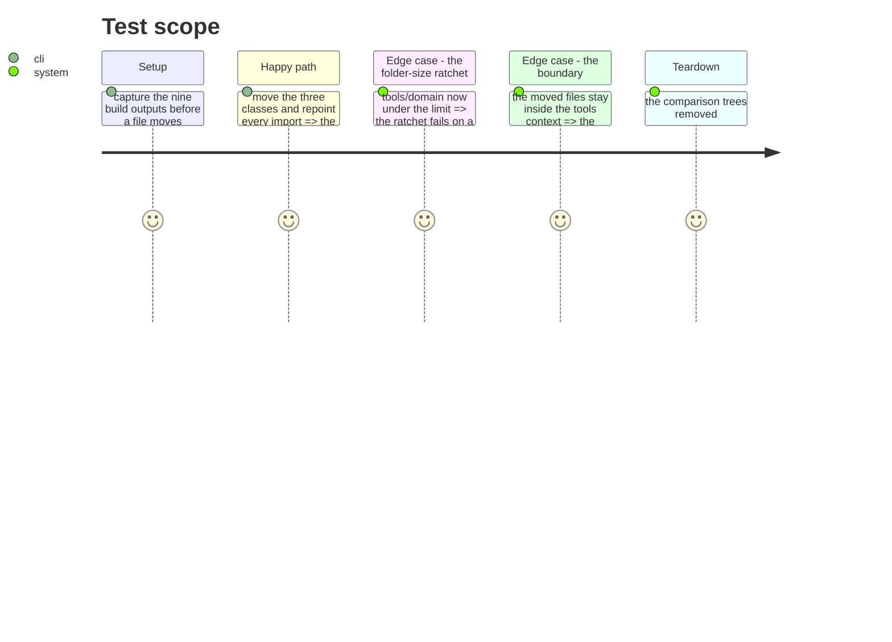

# Instruction: Put the capability classes where the capability classes live

`src/contexts/tools/domain` holds twelve direct files against a limit of ten. Three of them
are capability classes sitting beside the folder that holds the other five.

| In `capabilities/` | Beside it |
| ------------------ | --------- |
| `AgentsCapability`, `CommandsCapability`, `HooksCapability`, `RulesCapability`, `SkillsCapability` | `McpCapability`, `PluginsCapability`, `SettingsCapability` |

Same suffix, same role in a profile's `capabilities` object, two locations, no reason
written anywhere. Moving the three takes the folder to nine — under the limit because the
inconsistency is gone, not because three files were shuffled to satisfy a count.

## Architecture projection

```txt
.
└── cli/src/contexts/tools/domain/
    ├── mcp-capability.ts          ❌ moved
    ├── plugins-capability.ts      ❌ moved
    ├── settings-capability.ts     ❌ moved
    └── capabilities/
        ├── mcp-capability.ts       ✅ here
        ├── plugins-capability.ts   ✅ here
        └── settings-capability.ts  ✅ here
```

## Test Scope



## Tasks to do

### `1)` Move, and repoint

1. The three files into `capabilities/`, with every importer updated.
2. Nothing else changes: no rename, no signature, no behaviour.

### `2)` Take the entry out of the ratchet

1. `src/contexts/tools/domain` leaves `folder-size`'s baseline. The ratchet fails on a stale
   entry, so this is not optional — it is how the test tells you the debt is paid.

## Test acceptance criteria

| Task | Acceptance criteria |
| ---- | ------------------- |
| 1 | Nine target/mode builds byte-identical to the pre-move capture |
| 2 | `folder-size` passes with the entry gone, and fails if it is left in |
| all | Types, lint, knip, suite with equal ratios, architecture, smoke — all green |
