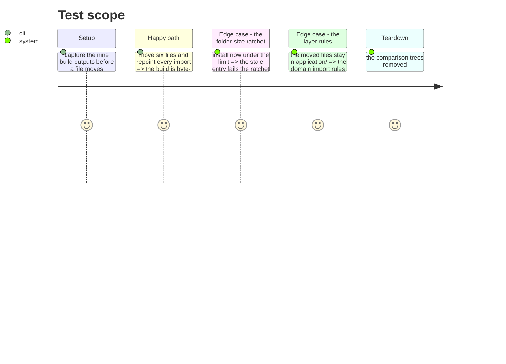

# Instruction: Give the install folder its two real groupings

`src/contexts/framework/application/install` holds twelve direct files. Two groupings are
already there, unstated.

**A use case in the wrong folder.** `uninstall-tools-use-case.ts` lives in `install/`, and
its only importers inside the context are `uninstall/uninstall-use-case.ts` and
`uninstall/uninstall-ide-use-case.ts` — the folder it should have been in. Four files import
it in all: those two, `runtime/wiring/framework.ts`, which imports everything, and its test.

**Four descriptors around one engine.** `install-{agents,commands,rules,skills}-use-case.ts`
are 33 to 35 lines each, every one of them a `ContentSectionDescriptor` handed to the same
`InstallContentSectionUseCase`. They are one idea in five files.

## Architecture projection

```txt
.
└── cli/src/contexts/framework/application/
    ├── install/
    │   ├── uninstall-tools-use-case.ts          ❌ moved to uninstall/
    │   └── content/                              ✅ create
    │       ├── install-content-section-use-case.ts   ✅ moved (the engine)
    │       ├── install-agents-use-case.ts            ✅ moved
    │       ├── install-commands-use-case.ts          ✅ moved
    │       ├── install-rules-use-case.ts             ✅ moved
    │       └── install-skills-use-case.ts            ✅ moved
    └── uninstall/
        └── uninstall-tools-use-case.ts           ✅ here, beside its importers
```

`install/` drops from twelve to six.

## Test Scope



## Tasks to do

### `1)` Put the uninstall use case with the uninstalls

1. Move it, repoint its four importers, change nothing else.

### `2)` Gather the content sections

1. `install/content/` holds the engine and its four descriptors.
2. No merge, no rename: five files, one folder. Merging them into one is a different change
   with a different risk, and it does not belong in a move.

### `3)` Take the entry out of the ratchet

1. `src/contexts/framework/application/install` leaves `folder-size`'s baseline.

## Test acceptance criteria

| Task | Acceptance criteria |
| ---- | ------------------- |
| 1 | Nine target/mode builds byte-identical to the pre-move capture |
| 2 | `install/` holds six direct files; nothing was renamed or merged |
| 3 | `folder-size` passes with the entry gone, and fails if it is left in |
| all | Types, lint, knip, suite with equal ratios, architecture, smoke — all green |
