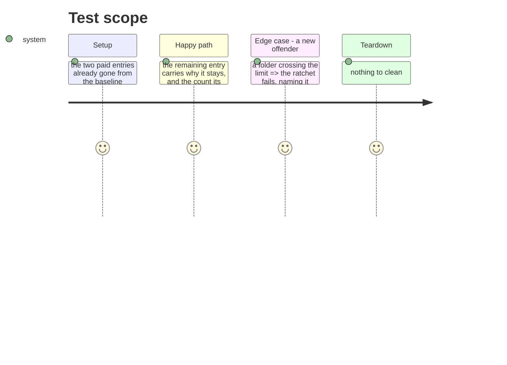

# Instruction: Replace the two remaining promises with their reason

`folder-size`'s baseline says `src/presentation/commands` is over the limit and "split
remains for a later phase", and calls `src/kernel` and the two others "born of this refactor
and to be split by a later phase". Two of the four are now paid. The other two will not be,
and saying so is worth more than carrying the promise.

**`src/kernel` — eleven files.** It is the vocabulary all four contexts speak: errors, file,
paths, markdown, jsonc, merge, scope, source, tool. Any folder here would be a category
invented for the count — `text/` and `paths/` are not concepts this repo has, and every
import in every context grows a segment to express them.

**`src/presentation/commands` — fourteen files.** Thirteen are one command each, which is
the flattest possible mapping from the CLI's surface to its source. The two helpers
(`global-options.ts`, `spawn-cli-command.ts`) could move, taking the folder to twelve, which
is still over the limit and buys nothing.

## Architecture projection

```txt
.
└── cli/tests/architecture/folder-size.arch.test.ts   ✏️ the baseline carries reasons, not promises
```

## Test Scope



## Tasks to do

### `1)` Say why each stays

1. Replace the "later phase" wording with the reason, one entry at a time, in the shape
   `tool-addition-cost` already uses for what it does not intend to fix.
2. Nothing else changes: the limit stays ten, the rule stays the same.

### `2)` Prove the ratchet still catches a newcomer

1. A synthetic folder past the limit must fail the test by name, and the two justified
   entries must not.

## Test acceptance criteria

| Task | Acceptance criteria |
| ---- | ------------------- |
| 1 | No entry in the baseline promises a future phase; each says why it is there |
| 2 | A folder pushed past the limit fails the ratchet by name |
| all | Types, lint, knip, suite with equal ratios, architecture, smoke — all green |
