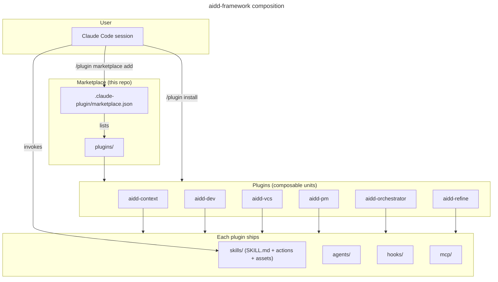
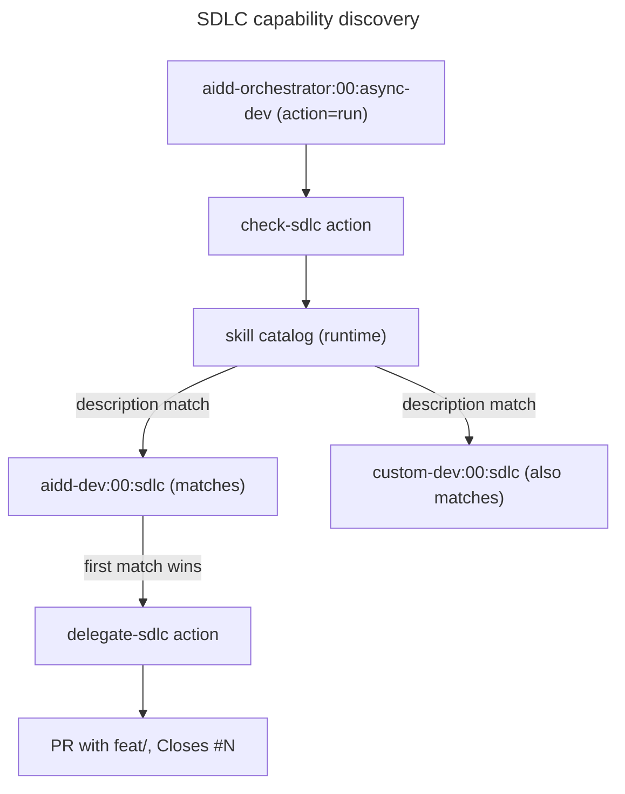

# Architecture

How the AI-Driven Dev Framework composes inside Claude Code.

## High-level



## Anatomy of a plugin

Every plugin under `plugins/<plugin>/` follows the same shape:

```
plugins/<plugin>/
├── .claude-plugin/
│   └── plugin.json        # manifest (name, version, description, $schema)
├── README.md              # human-facing landing page
├── CATALOG.md             # per-plugin auto-generated index
├── skills/                # router-based skills
│   └── <NN>-<name>/
│       ├── SKILL.md        # contract (name, description, actions table)
│       ├── README.md       # human-facing skill landing
│       ├── actions/        # atomic actions invoked by the router
│       ├── assets/         # templates and static files
│       ├── references/     # extended docs the skill links into
│       └── evals/          # scenario fixtures
├── agents/                 # named AI agents (optional)
├── hooks/                  # Claude Code hooks (optional)
└── mcp/                    # MCP server configuration (optional)
```

The `plugin.json` is validated against [`claude-code-plugin-manifest`](https://www.schemastore.org/claude-code-plugin-manifest.json) on every commit (via `lefthook`). The marketplace's `marketplace.json` is validated against [`claude-code-marketplace`](https://www.schemastore.org/claude-code-marketplace.json) the same way.

## Skills are routers

A skill's `SKILL.md` is a manifest plus an actions table. Claude Code loads the SKILL.md when the skill is invoked; the body decides which action(s) to run.


Each action is a self-contained markdown file with inputs, outputs, depends-on, process steps, and a test checklist. Actions can call other skills via the `Skill` tool, enabling capability discovery and delegation across plugins.

## SDLC capability discovery

Two plugins (currently `aidd-dev:00:sdlc` and `aidd-orchestrator`) advertise themselves as SDLC orchestrators in their `description` frontmatter. Other plugins discover them at runtime by matching the description (never by hardcoded plugin name), which keeps the system swappable: replace `aidd-dev` with any plugin that advertises SDLC orchestration and the orchestrator's `02:run-async-dev` skill will delegate to it instead.



## Cross-plugin orthogonality

Plugins do not reference each other by name. When skill A needs a capability owned by skill B, it discovers a candidate at runtime through description matching. This rule keeps the marketplace forkable, the plugins swappable, and the docs maintainable.

The rule is enforced both socially (PR template checklist) and mechanically (lefthook hooks could be extended to grep for cross-plugin literal references).

## See also

- [`CREATE_PLUGIN.md`](CREATE_PLUGIN.md) - build and publish your own plugin.
- [`GLOSSARY.md`](GLOSSARY.md) - terminology used across the framework.
- [`CATALOG.md`](CATALOG.md) - every skill in one index.
- [`../CONTRIBUTING.md`](../CONTRIBUTING.md) - contribution flow.
