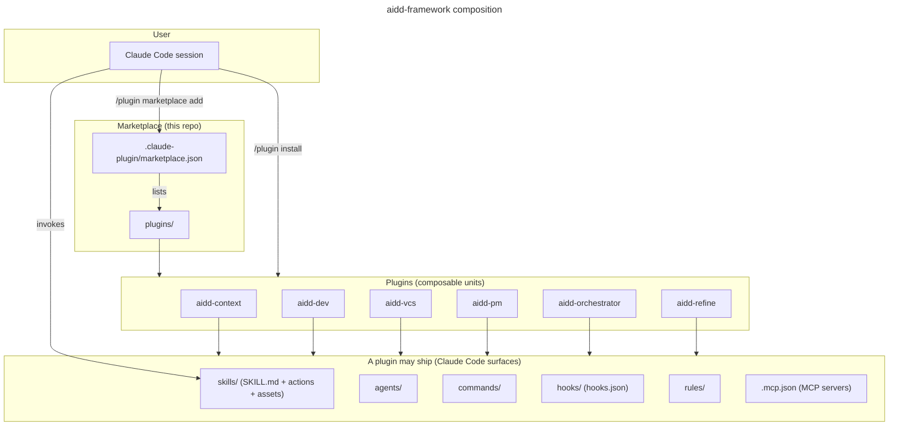
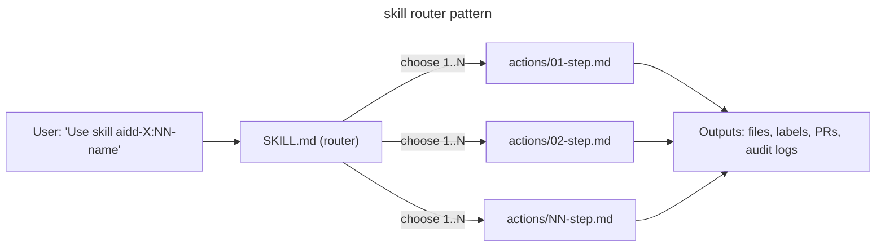

# Architecture

How the AI-Driven Dev Framework composes inside Claude Code. If a term here is unfamiliar, check [`GLOSSARY.md`](GLOSSARY.md) first.

## High-level

This repo is a **marketplace**: a catalog of **plugins**. Claude Code reads the marketplace manifest, lets you install plugins from it, and then invokes the **skills** those plugins ship.



## Anatomy of a plugin

Every plugin under `plugins/<plugin>/` follows the same folder shape:

```
plugins/<plugin>/
├── .claude-plugin/
│   └── plugin.json        # manifest (name, version, description, skills[], $schema)
├── README.md              # human-facing landing page
├── CATALOG.md             # per-plugin auto-generated index
├── CHANGELOG.md           # release-please-managed
├── skills/                # router-based skills
│   └── <NN>-<name>/
│       ├── SKILL.md        # contract (name, description, actions table)
│       ├── README.md       # human-facing skill landing
│       ├── actions/        # atomic actions invoked by the router
│       ├── assets/         # templates and static files
│       └── references/     # extended docs the skill links into
├── agents/                 # named AI agents          (optional)
├── commands/               # slash commands           (optional)
├── hooks/hooks.json        # lifecycle hooks          (optional)
├── rules/                  # coding rules             (optional)
└── .mcp.json               # MCP server configuration (optional)
```

Only two things are required: the manifest and `skills/`. Everything else (agents, commands, hooks, rules, MCP servers) is optional, and a plugin can ship any mix of them. Browse the [plugins](../plugins/) folder to see which surfaces each one actually uses.

Two checks keep manifests honest:

- A `lefthook` pre-commit hook validates each `plugin.json` against the [`claude-code-plugin-manifest`](https://www.schemastore.org/claude-code-plugin-manifest.json) schema, and `marketplace.json` against [`claude-code-marketplace`](https://www.schemastore.org/claude-code-marketplace.json). This needs the JSON-schema validator (`pipx`/`check-jsonschema`) installed.
- The `validate` GitHub workflow re-runs the same checks on every push and PR.

## Plugin concerns and layers

Every capability lives in exactly one plugin. Which plugin is decided by its **concern**: the kind of problem it solves. This table is the canonical source for that mapping; each `plugin.json` only implies it.

| Plugin              | Concern              | Layer        |
| ------------------- | -------------------- | ------------ |
| `aidd-context`      | Knowledge production | Knowledge    |
| `aidd-pm`           | Product management   | Knowledge    |
| `aidd-refine`       | Meta-cognition       | Knowledge    |
| `aidd-dev`          | Code transformation  | Execution    |
| `aidd-vcs`          | Version control      | External     |
| `aidd-orchestrator` | Orchestration        | Coordination |

Three rules follow from this table:

1. **Knowledge and execution are separated by a firewall.** Knowledge plugins only produce things you *read*: docs, plans, memory. They never write or run application source code. For example, `aidd-context`'s bootstrap never creates a `package.json` or source files. Real code is written by `aidd-dev`, or by an orchestrator's own setup actions.
2. **The concern owns the capability, even if it doesn't exist yet.** If a plugin needs a capability it doesn't have, it goes in the plugin whose concern owns it, and the caller delegates to it there. Do not reimplement it locally just because the right home doesn't have it today.
3. **Orchestration means sequencing, not deep logic.** An orchestrator's job is to sequence steps across multiple concerns, with little domain logic of its own. Any skill can delegate one sub-step to another skill (see [Cross-plugin orthogonality](#cross-plugin-orthogonality)); doing that once does not make it an orchestrator. A true orchestrator only owns the glue between steps, and hands off through a seam artifact (for example, an `INSTALL.md` file one plugin produces and another consumes).

## Skills are routers

**In short:** a skill's `SKILL.md` file does not do the work itself; it reads the request and picks which action file(s) should run.

Claude Code loads `SKILL.md` when a skill is invoked. Its body then routes to one or more actions.



Each action is a self-contained markdown file. It lists inputs, outputs, what it depends on, the steps to run, and a test checklist.

Actions can call other skills, using the `Skill` tool. This lets a skill find a capability it needs at runtime, by matching skill descriptions, never by hardcoding a plugin name, and delegate to it.

## Skills and agents

- A **skill** is a caller-agnostic recipe. It runs inside the context of whoever invoked it.
- An **agent** is an isolated executor. It runs in its own separate context and returns only a result.

**How to choose:** if you want the work visible step-by-step to the caller, use a skill. If you want to isolate the work and get back only the final result, use an agent.

Composition rules:

- **Only an orchestrator decides to spawn an agent.** A plain recipe skill never spawns one; it always runs inline in the caller's context. A high-level orchestrator skill (for example, the SDLC orchestrator) is the only kind allowed to spawn agents, and it decides per step whether that step needs isolation or can run inline.
- **An orchestrator's steps are either inline recipes or leaf agents.** Each step either runs as a leaf agent wrapping one recipe, or runs the recipe directly when no isolation is needed. For example, the SDLC orchestrator runs `01-plan` inline (in its own context), then spawns two workers: `executor` (runs `02-implement`) and `checker` (runs `05-review`). The agent boundary is where isolation happens; the recipe inside an agent never spawns further agents.
- **An agent can only call the skills it declares.** It lists these under `# Skills you may invoke`. It can never call an orchestrator skill, and never reads a skill's underlying files directly. A same-plugin skill is named by its exact `plugin:folder` address. A cross-plugin skill is named by capability instead, per [Cross-plugin orthogonality](#cross-plugin-orthogonality).
- **Agents cannot chain into other agents.** An agent never hands flow control to another agent, and never invokes an orchestrator skill. The one exception: it may spawn a read-only recon helper (for example `Explore`) that mutates nothing and spawns nothing itself. This keeps the write path exactly two layers deep, so delegation can never cycle.

## Cross-plugin orthogonality

**In short:** plugins never hardcode each other's names. They find each other by describing what they need.

When skill A needs a capability owned by skill B, A does not reference B by name. Instead, it discovers a matching skill at runtime by comparing descriptions.

This keeps the marketplace forkable, keeps plugins swappable, and keeps the docs easier to maintain.

The rule is enforced two ways: socially, through the PR template checklist, and mechanically, since lefthook hooks could be extended to grep for cross-plugin literal references.

## See also

- [`CREATE_PLUGIN.md`](CREATE_PLUGIN.md) - build and publish your own plugin.
- [`GLOSSARY.md`](GLOSSARY.md) - terminology used across the framework.
- [`../CONTRIBUTING.md`](../CONTRIBUTING.md) - contribution flow.
