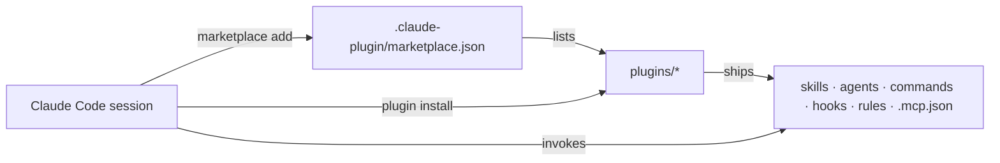
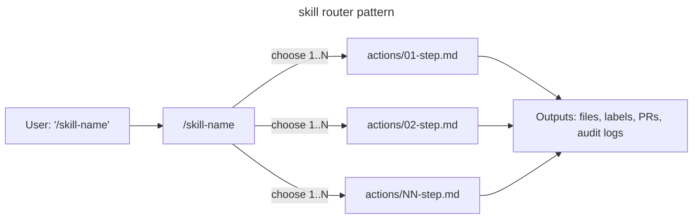

# 🏛️ Architecture

How the AI-Driven Dev Framework composes inside Claude Code.

## 🗺️ High-level


```mermaid
flowchart LR
  Editor["Claude Code session"] -->|"marketplace add"| Manifest[".claude-plugin/marketplace.json"]
  Manifest -->|lists| Plugins["plugins/*"]
  Editor -->|"plugin install"| Plugins
  Plugins -->|ships| Surfaces["skills · agents · commands · hooks · rules · .mcp.json"]
  Editor -->|invokes| Surfaces
```

## 🧩 Anatomy of a plugin

```txt
plugins/<plugin>/
├── .claude-plugin/plugin.json   # manifest (name, version, description, skills[], $schema)
├── README.md · CATALOG.md · CHANGELOG.md
├── skills/<NN>-<name>/
│   ├── SKILL.md                 # router: frontmatter, flow, actions table, transversal rules
│   ├── actions/                 # the atomic steps the router dispatches to
│   ├── assets/                  # templates and static files
│   └── references/              # one responsibility per file, linked from this skill only
├── agents/ · commands/ · hooks/hooks.json · rules/ · .mcp.json   (all optional)
```

Only `skills/` and the manifest are universal; a plugin ships any subset of the rest.

A plugin never contains its own tests: the build copies `hooks/` recursively into every user project, so a test folder there would ship to them. Tests for a bundled script live in `scripts/__tests__/`.

`plugin.json` and `marketplace.json` are validated against their [plugin](https://www.schemastore.org/claude-code-plugin-manifest.json) and [marketplace](https://www.schemastore.org/claude-code-marketplace.json) schemas, in the `lefthook` pre-commit hook and again in the `validate` workflow.

## 🪝 Bundled hooks

Declared in `plugins/<plugin>/hooks/hooks.json`. They run Node, so users need `node` on their `PATH`:

| Plugin           | Event                                    | Runs                      | Purpose                                                              |
| ---------------- | ----------------------------------------- | ------------------------- | --------------------------------------------------------------------- |
| `aidd-context`   | `SessionStart`                            | `hooks/update_memory.js`  | Refresh the project memory block in the AI context files              |
| `aidd-telemetry` | `SessionStart` · `Stop` · `PostToolUse`   | `hooks/journal.cjs`        | Journal every session so a unit of work can be tied to what it cost   |

A hook is authored once, with `${CLAUDE_PLUGIN_ROOT}`, and the installer rewrites it to whatever the target tool expands. Which tools run a bundled hook at all, and what each resolves:

| Tool          | Runs bundled hooks | Resolves the plugin root as | Notes                                                                                  |
| ------------- | ------------------ | --------------------------- | ---------------------------------------------------------------------------------------- |
| Claude Code   | yes                | `${CLAUDE_PLUGIN_ROOT}`     | The spelling every plugin is authored in, so nothing is substituted                    |
| Codex         | yes                | `${PLUGIN_ROOT}`            | Measured: it expands `${CLAUDE_PLUGIN_ROOT}` too, and will not run a hook it has not been asked to trust |
| GitHub Copilot| yes                | `${PLUGIN_ROOT}`            | Declared, never observed against a running hook                                        |
| Cursor        | declared            | `./`                        | Its own hook format: the converter rewrites the root to a path relative to the plugin before the declared token is ever substituted. Two headless probes fired no plugin hook at all, and what registers a plugin sitting in Cursor's own plugin directory was not identified |
| OpenCode      | no, by a second route | —                        | A declarative `hooks.json` means nothing to it — its plugin runtime is JS modules, so it joins through one instead: `plugins/aidd-telemetry/hooks/opencode-plugin.js` maps `session.created` to session-start, `session.idle` to turn-end, and (2026-08-31) a completed tool part on `message.part.updated` to tool-used. The column above is about the declarative axis alone; a tool answering `no` there is not a tool that cannot journal |

A tool that runs no hook says why, and an install that carries one tells whoever ran it what was skipped.

## ⚖️ What runs on every event, and what runs when someone asks

Measured on one machine, 12 runs each, median: the bundled hook starts in **27 ms**, the CLI
in **180 ms** — 6.7× — and `PostToolUse` fires on every tool call a session makes. A
thousand tool calls is 153 seconds of added latency, so the difference is not a preference.

The line is therefore **not** "plugin or CLI". It is what the code is answering to:

| | Triggered by | Latency | Runs as |
| --- | --- | --- | --- |
| Observing | a tool event, thousands of times a session | must not be felt | plain Node in `hooks/`, no install, no dependency |
| Answering | a person or a skill, once | irrelevant | the `aidd` CLI |

Two consequences, both already paid for:

- A capability that answers belongs in the CLI even when a plugin is what asks for it. The
  telemetry pivot deleted 25 files and 4,355 lines of skill-owned scripts on that argument:
  one implementation cannot drift from a copy of itself, and the copies had drifted.
- A skill that needs the CLI must say so out loud when it is absent, never quietly do
  nothing. The wording is pinned identically across every such skill by
  `scripts/__tests__/telemetry-cli-required.test.js`, so a fourth skill cannot invent a
  fourth phrasing.

The cost of the pivot is real and is stated rather than argued away: a plugin that once
promised "no npm install, no CLI, no account" now needs `node` to measure and `aidd` to
answer. Writing that a hook can move to the CLI, or that a skill may keep its own script
because it is small, re-opens a question that was settled with numbers.

## 🧠 Plugin concerns and layers

Every capability lives in exactly one plugin, chosen by **concern**. This taxonomy decides placement; it is only implicit in each `plugin.json`, so it is canonical here.

| Plugin              | Concern              | Layer        |
| ------------------- | -------------------- | ------------ |
| `aidd-context`      | Knowledge production | Knowledge    |
| `aidd-pm`           | Product management   | Knowledge    |
| `aidd-refine`       | Meta-cognition       | Knowledge    |
| `aidd-dev`          | Code transformation  | Execution    |
| `aidd-vcs`          | Version control      | External     |
| `aidd-orchestrator` | Orchestration        | Coordination |
| `aidd-ui` 🚧        | UI/UX design         | Execution    |
| `aidd-telemetry` 🧪 | Measurement          | Observation  |

`aidd-ui` is alpha: smoke-test only, off the curated install path.

`aidd-telemetry` is beta, off the curated install path: opt-in only — a repository must commit `.aidd/config.json` with `telemetry.enabled: true`. Each session appends observations, one JSON object per line, to its own `aidd_docs/runs/<run_id>__<vendor_id>.jsonl`, created on demand and git-ignored; that directory's presence is a location, not a permission. A line is never rewritten, only appended — `session_start`, `turn_end`, and `file_written` (a repository-relative path, never a task_id: task identity is a derivation, and belongs to whatever reads the log). Never a measurement; tokens and cost are joined afterwards from the provider's telemetry.

**Observation** writes only *about* the other layers, never the artifact it describes, and nothing may depend on it.

- **Knowledge vs execution is a firewall.** Knowledge plugins produce artifacts you *read* and never write or run application source. `aidd-context`'s bootstrap deliberately creates no `package.json`. Real code belongs to `aidd-dev` or an orchestrator's own setup actions.
- **Concern decides placement, not existence.** A missing capability goes in the plugin whose concern owns it, then the caller delegates. Never reimplement it in the calling plugin because the right home lacks it today.
- **Orchestration = sequencing across concerns** with little domain logic. Delegating a sub-step once does not make a skill an orchestrator. The orchestrator owns only glue and hands off through a seam artifact, for example an `INSTALL.md` one plugin produces and another consumes.
- `aidd-orchestrator:02-backlog` owns the cross-artifact flow. Each artifact's contract stays in its `aidd-pm` skill, so a direct PM call follows the same rules as an orchestrated one.

## 🔀 Skills are routers

A skill's `SKILL.md` is a manifest plus a router. Claude Code loads the SKILL.md when the skill is invoked; the body decides which local action or orchestration protocol to run.


```mermaid
---
title: skill router pattern
---
flowchart LR
  User["User: '/skill-name'"]
  Skill["/skill-name"]
  Action1["actions/01-step.md"]
  Action2["actions/02-step.md"]
  ActionN["actions/NN-step.md"]
  Out["Outputs: files, labels, PRs, audit logs"]

  User --> Skill
  Skill -->|"choose 1..N"| Action1
  Skill -->|"choose 1..N"| Action2
  Skill -->|"choose 1..N"| ActionN
  Action1 --> Out
  Action2 --> Out
  ActionN --> Out
```

Recipe skills route to self-contained actions with inputs, outputs, process steps, and tests. An orchestrator with no domain logic may instead route through numbered reference protocols that define handoffs and delegate the work to capabilities discovered at runtime.

A skill never links outside itself. The same tree ships flat, where the skill folder is renamed `<plugin>-<skill>`, or as a marketplace, so no relative path survives both. A bundled script is named plugin-relative in backticks, never linked.

## 🤖 Skills and agents

- A **skill** is a caller-agnostic recipe; it runs in the context of whoever invokes it.
- An **agent** is an isolated executor; it runs in its own context and returns only a result.

Choose by context, not complexity: keep the work visible to the caller → skill; isolate it and take only the result → agent.

- **Spawning is authorized by the high-level orchestrator, never invented by a recipe skill.** A recipe skill normally runs in the caller's context. A bounded fan-out capability may mechanically spawn leaf agents only when the orchestrator explicitly delegates that responsibility and retains routing ownership.
- An orchestrator spawns each isolated step as a leaf agent that runs a recipe, or runs the recipe itself when isolation is unnecessary. The SDLC owns planning, delegates delivery to `executor`, and delegates independent judgments to a fresh `checker`. For independent repair findings, it may explicitly delegate bounded fan-out to `10-todo`; Todo's leaf executors return their results to the SDLC. A recipe invoked inside an agent never spawns again.
- An agent invokes only the recipe skills it declares under `# Skills you may invoke`, never an orchestrator skill, and never reads a skill's files. It names every skill by its canonical `/plugin:folder` address so its permissions are explicit and auditable.
- An agent never delegates flow work to another agent and never invokes an orchestrator skill. It may spawn a read-only recon helper (for example `Explore`) that mutates nothing and spawns nothing. So the write path stays two layers deep and delegation can never cycle.

## 🔗 Capability addressing

Address a capability only where the dispatch is declared: a router's `## Actions` table, an agent's `# Skills you may invoke` list. Everywhere else, name the concept the capability owns, never the skill that owns it.

Recipe skills never hardcode a sibling provider. They discover cross-plugin capabilities at runtime through description matching. Agent permission lists and orchestration references are responsibility maps, so they name the current provider with its canonical `/plugin:folder` or `@plugin:agent` address. The orchestrator must verify that provider is installed before calling it.

This distinction keeps recipe plugins swappable while making orchestration handoffs explicit and auditable.

## 🔎 See also

- [`CREATE_PLUGIN.md`](CREATE_PLUGIN.md) - build and publish your own plugin.
- [`GLOSSARY.md`](GLOSSARY.md) - terminology used across the framework.
- [`../CONTRIBUTING.md`](../CONTRIBUTING.md) - contribution flow.
