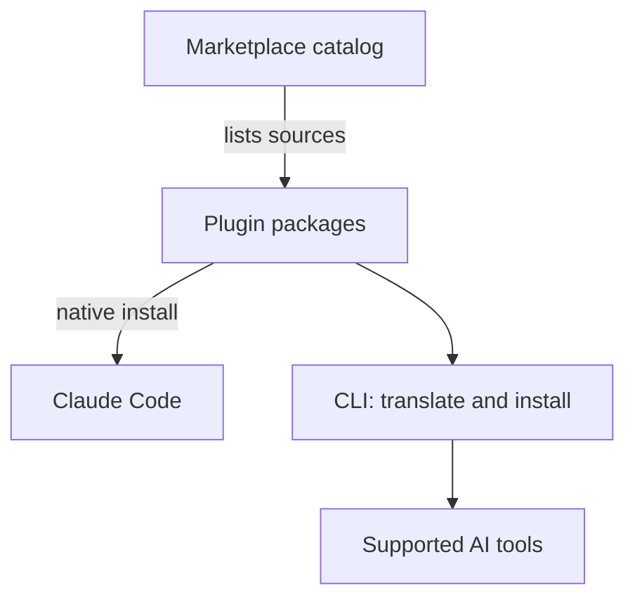
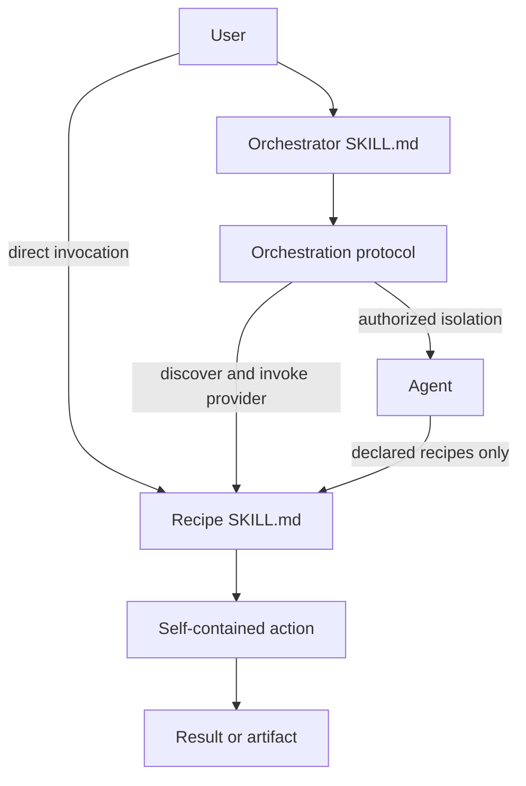

# Architecture

AIDD packages AI-assisted work into plugins, each owning one concern.

## Marketplace and installation

```mermaid
flowchart TB
  Catalog["Marketplace catalog"] -->|lists sources| Plugins["Plugin packages"]
  Plugins -->|native install| Claude["Claude Code"]
  Plugins --> CLI["CLI: translate and install"]
  CLI --> Tools["Supported AI tools"]
```

| Element | Responsibility |
| --- | --- |
| `.claude-plugin/marketplace.json` | Lists plugins and their sources. |
| `plugins/<name>/` | Holds a plugin's manifest and capabilities. |
| AI tool | Loads capabilities and executes work. |
| CLI | Translates supported capabilities; reports unavailable surfaces. |

Marketplace and plugins version independently. See the [marketplace guide](MARKETPLACE.md) for registration, scopes and updates.

## 🧩 Anatomy of a plugin

Manifest and skills are required in AIDD; other capabilities are optional. Locations are relative to the plugin directory.

| Component | Location | Role |
| --- | --- | --- |
| Manifest | `.claude-plugin/` | `plugin.json`: identity, version and declared capabilities. |
| Skill | `skills/<name>/SKILL.md` | Routes requests to actions or a protocol. |
| Actions | `skills/<name>/actions/` | Inputs, outputs, procedure and checks. |
| Assets | `skills/<name>/assets/` | Reusable templates and static files. |
| References | `skills/<name>/references/` | Supporting documentation and handoff protocols. |
| Agents | `agents/` | Isolated specialist roles. |
| Commands | `commands/` | Flat prompts invoked as slash commands. |
| Hooks | `hooks/hooks.json` and `hooks/` scripts | Deterministic programs triggered by lifecycle events. |
| MCP configuration | `.mcp.json` | External tools and data via Model Context Protocol servers. |
| Documentation | `README.md` · `CATALOG.md` · `CHANGELOG.md` | Usage, capability inventory and release history. |

Project rules belong in the host's rules directory, such as `.claude/rules/`. `aidd-context` generates them as project context, outside native Claude plugin surfaces.

Package validation

| Check | Contract |
| --- | --- |
| Manifests | [Plugin](https://www.schemastore.org/claude-code-plugin-manifest.json) and [marketplace](https://www.schemastore.org/claude-code-marketplace.json) schemas; validated by `lefthook` and the `validate` workflow. |
| Tests | Keep in `scripts/__tests__/`, outside shipped trees: `hooks/` is copied recursively into user projects. |

## Responsibilities

Place each capability in its owning concern and delegate to it.

| Plugin              | Concern              | Layer        |
| ------------------- | -------------------- | ------------ |
| `aidd-context`      | Knowledge production | Knowledge    |
| `aidd-pm`           | Product management   | Knowledge    |
| `aidd-refine`       | Meta-cognition       | Knowledge    |
| `aidd-dev`          | Code transformation  | Execution    |
| `aidd-vcs`          | Version control      | External     |
| `aidd-orchestrator` | Orchestration        | Coordination |
| `aidd-ui`        | UI/UX design         | Execution    |
| `aidd-telemetry` | Measurement          | Observation  |
| `aidd-qa`         | Acceptance QA        | Execution    |

### Layer boundaries

| Layer | Boundary |
| --- | --- |
| Knowledge | Produces context and specifications; never writes or runs application source. Context bootstrap creates no `package.json`. |
| Execution | Changes or validates application source. |
| External | Owns version control. |
| Coordination | Sequences artifacts (for example `INSTALL.md`). Domain logic and artifact contracts stay with their owners; direct and orchestrated calls obey the same contracts. |
| Observation | Records work without changing observed artifacts. Productive flows never depend on it. |

### Measurement boundary

Measurement is being rebuilt on a deterministic design; its contract lands with the replacement. Until then `aidd-telemetry` ships no hook and no skill.

## Execution model

### Skills and actions

```mermaid
flowchart TB
  User["User"] --> Router["Orchestrator SKILL.md"]
  Router --> Protocol["Orchestration protocol"]
  User -->|direct invocation| Recipe["Recipe SKILL.md"]
  Protocol -->|discover and invoke provider| Recipe
  Protocol -->|authorized isolation| Agent["Agent"]
  Agent -->|declared recipes only| Recipe
  Recipe --> Action["Self-contained action"]
  Action --> Result["Result or artifact"]
```

### Agents and delegation

| Role | Contract |
| --- | --- |
| Skill | Host loads `SKILL.md` on invocation; work runs in the caller's context. |
| Orchestrator | Owns routing; authorizes isolation or bounded fan-out. |
| Agent | Isolates work and returns a result. Invokes only declared canonical recipe skills; never invokes orchestrators or reads skill files. |
| Recipe | Never invents spawning; an isolated recipe never delegates flow work. |
| Reconnaissance helper | Read-only; neither mutates nor spawns. |
| Write path | At most two delegation layers; no cycles. |
| SDLC | Owns planning; [delivery](../plugins/aidd-orchestrator/skills/01-sdlc/references/02-deliver.md) and [check](../plugins/aidd-orchestrator/skills/01-sdlc/references/03-check.md) govern execution, leaf executors, independent judgment and bounded repair. |

### 🪝 Bundled hooks

Dependency-free Node scripts declared in `hooks/hooks.json`; `node` must be on `PATH`.

| Plugin           | Event                                   | Runs                     | Purpose                                                     |
| ---------------- | --------------------------------------- | ------------------------ | ----------------------------------------------------------- |
| `aidd-context`   | `SessionStart`                          | `hooks/update_memory.js` | Refresh the project memory block in the AI context files    |

## Portability

| Surface | Contract | Reference |
| --- | --- | --- |
| CLI output | Supported target capabilities only; `aidd translate` warns and skips rules and commands. | [Output layouts](../cli/README.md#translate) |
| Skills | Links stay inside the skill directory. Flat distribution renames skills `<plugin>-<skill>`; marketplace installation preserves the tree. | [Portability guard](../scripts/__tests__/a-skill-links-only-inside-itself.test.js) |
| Bundled scripts | Named plugin-relative in backticks, never linked. | [Portability guard](../scripts/__tests__/a-skill-links-only-inside-itself.test.js) |
| Hook adapters | CLI owns OpenCode's shared host protocol; plugins own payload mapping. | [Delivery and compatibility](../cli/ARCHITECTURE.md#hook-adaptation) |

## Capability discovery and addressing

| Context | Rule |
| --- | --- |
| Dispatch tables (`## Actions`), orchestration references and agent permissions (`# Skills you may invoke`) | Canonical `/plugin:folder` or `@plugin:agent` addresses. Elsewhere, name the responsibility. |
| Cross-plugin providers | Recipes discover by description rather than hardcoding siblings; orchestrators verify installation before dispatch. |
| Backlog flow | Owned by `aidd-orchestrator:02-backlog`. |
| Orthogonality exceptions | `isExemptFromOrthogonality` permits responsibility maps in `plugins/aidd-orchestrator/**` and onboarding menus in `plugins/aidd-context/skills/00-onboard/**`. The onboarding exemption ends with runtime provider discovery. |

## References

| Document | Question answered |
| --- | --- |
| [Framework README](../README.md) | What can I use, and how do I start? |
| [Marketplace guide](MARKETPLACE.md) | How do registration, scopes and updates work? |
| [Create a plugin](CREATE_PLUGIN.md) | How do I author and publish a plugin? |
| [Glossary](GLOSSARY.md) | What do the terms mean? |
| [CLI reference](../cli/README.md) | Which commands and output layouts are supported? |
| [CLI architecture](../cli/ARCHITECTURE.md) | How are translation and installation implemented? |
| [Contributing](../CONTRIBUTING.md) | How do I contribute to this repository? |
| [Maintainers guide](MAINTAINERS.md) | How are repository operations and releases managed? |
| [Claude plugin reference](https://code.claude.com/docs/en/plugins-reference) | How do native plugin components behave? |
