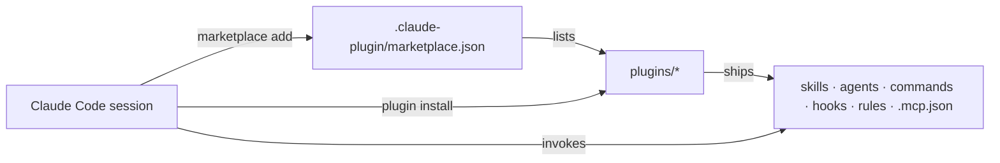
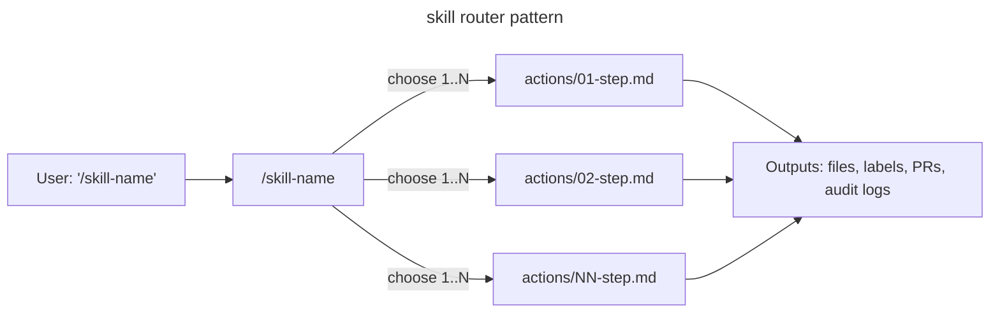

# 🏛️ Architecture

How the AI-Driven Dev Framework composes inside Claude Code.

## 🗺️ High-level


```mermaid
flowchart LR
  Editor["Claude Code session"] -->|"marketplace add"| Manifest[".claude-plugin/marketplace.json"]
  Manifest -->|lists| Plugins["plugins/*"]
  Editor -->|"plugin install"| Plugins
  Plugins -->|ships| Surfaces["skills · agents · commands · hooks · rules · .mcp.json"]
  Editor -->|invokes| Surfaces
```

## 🧩 Anatomy of a plugin

```txt
plugins/<plugin>/
├── .claude-plugin/plugin.json   # manifest (name, version, description, skills[], $schema)
├── README.md · CATALOG.md · CHANGELOG.md
├── skills/<NN>-<name>/
│   ├── SKILL.md                 # router: frontmatter, flow, actions table, transversal rules
│   ├── actions/                 # the atomic steps the router dispatches to
│   ├── assets/                  # templates and static files
│   └── references/              # one responsibility per file, linked from this skill only
├── agents/ · commands/ · hooks/hooks.json · rules/ · .mcp.json   (all optional)
```

Only `skills/` and the manifest are universal; the rest is optional.

A plugin never contains its own tests: the build copies `hooks/` recursively into every user project. Tests for a bundled script live in `scripts/__tests__/`.

`plugin.json` and `marketplace.json` are validated against their [plugin](https://www.schemastore.org/claude-code-plugin-manifest.json) and [marketplace](https://www.schemastore.org/claude-code-marketplace.json) schemas, in the `lefthook` pre-commit hook and in the `validate` workflow.

## 🪝 Bundled hooks

Declared in `plugins/<plugin>/hooks/hooks.json`. They run Node, so users need `node` on their `PATH`:

| Plugin           | Event                                   | Runs                     | Purpose                                                     |
| ---------------- | --------------------------------------- | ------------------------ | ----------------------------------------------------------- |
| `aidd-context`   | `SessionStart`                          | `hooks/update_memory.js` | Refresh the project memory block in the AI context files    |
| `aidd-telemetry` | `SessionStart` · `Stop` · `PostToolUse` | `hooks/journal.cjs`      | Journal every session so a unit of work can be tied to its cost |

A hook is authored once with `${CLAUDE_PLUGIN_ROOT}`; the installer rewrites it to the target tool's spelling:

| Tool           | Runs bundled hooks    | Plugin root            | Notes |
| -------------- | --------------------- | ---------------------- | ----- |
| Claude Code    | yes                   | `${CLAUDE_PLUGIN_ROOT}` | Authoring spelling, nothing substituted |
| Codex          | yes                   | `${PLUGIN_ROOT}`       | Also expands `${CLAUDE_PLUGIN_ROOT}`; runs a hook only once trusted |
| GitHub Copilot | yes                   | `${PLUGIN_ROOT}`       | Declared, never observed running |
| Cursor         | declared              | `./`                   | Own hook format: the converter rewrites the root to a plugin-relative path before token substitution. No plugin hook observed firing headless; what registers a plugin in Cursor's plugin directory is unknown |
| OpenCode       | no, by a second route | —                      | See below |

OpenCode runs no declarative hook. Instead, `opencode-hooks-bridge.ts` translates them into `<plugin>-hooks.js` modules for `SessionStart`, `Stop` and `PostToolUse`. Telemetry ships its own adapter, `plugins/aidd-telemetry/hooks/opencode-plugin.js`, because its journal uses a different stdin dialect. Both export a default definition: `server` for V1 1.18.29 or later, `setup` for V2.

- **V1** delivers `session.idle` and completed `message.part.updated` tool parts to an `event` hook. Each plugin keeps its own V1 payload adapter.
- **V2** uses one shared module, embedded and delivered by the CLI at `.opencode/hooks/opencode-events.js`, outside plugin discovery. Each plugin imports it for V2. It subscribes to `data`-based events over an abortable stream, correlates tool name and input with tool success, and maps execution terminals to turn-end. A shutdown interruption leaves the turn open, since OpenCode resumes it.
- The bridge fires its idempotent `SessionStart` hooks when either host initializes the module; telemetry records sessions separately from session events.
- Translation emits the module once and tool installation tracks it as a tool file. Plugin install and update backfill a missing module without rewriting user configuration or claiming an existing untracked one.

A tool that runs no hook says why, and an install that carries one reports what was skipped.

## ⚖️ What runs on every event, and what runs when someone asks

`PostToolUse` fires on every tool call, so the code on that path is a bundled hook, not the CLI. The line is therefore **not** "plugin or CLI" but what the code answers to:

| | Triggered by | Latency | Runs as |
| --- | --- | --- | --- |
| Observing | each tool event | must not be felt | plain Node in `hooks/`, no install, no dependency |
| Answering | a person or a skill, once | irrelevant | the `aidd` CLI |

- A capability that answers belongs in the CLI even when a plugin asks for it: one implementation cannot drift from a copy of itself.
- A skill that needs the CLI must say so when it is absent, never silently do nothing. The wording is pinned across those skills by `scripts/__tests__/telemetry-cli-required.test.js`.

Telemetry requires `node` to measure and `aidd` to answer.

## 🧠 Plugin concerns and layers

Every capability lives in exactly one plugin, chosen by **concern**. This taxonomy is only implicit in each `plugin.json`, so it is canonical here.

| Plugin              | Concern              | Layer        |
| ------------------- | -------------------- | ------------ |
| `aidd-context`      | Knowledge production | Knowledge    |
| `aidd-pm`           | Product management   | Knowledge    |
| `aidd-refine`       | Meta-cognition       | Knowledge    |
| `aidd-dev`          | Code transformation  | Execution    |
| `aidd-vcs`          | Version control      | External     |
| `aidd-orchestrator` | Orchestration        | Coordination |
| `aidd-ui` 🚧        | UI/UX design         | Execution    |
| `aidd-telemetry` 🧪 | Measurement          | Observation  |
| `aidd-qa` 🆕         | Acceptance QA        | Execution    |

Off the curated install path:

- `aidd-ui`: alpha, smoke-test only.
- `aidd-qa`: new, until proven outside this repository. Validates observable behavior against acceptance criteria and records browser evidence, hence Execution.
- `aidd-telemetry`: beta, opt-in. A repository must commit `.aidd/config.json` with `telemetry.enabled: true`. Each session appends one JSON object per line to its own git-ignored `aidd_docs/runs/<run_id>__<vendor_id>.jsonl`, created on demand; the directory's presence is a location, not a permission. Lines are append-only: `session_start`, `turn_end`, `file_written`, `step_start`, `step_end`, `task_declared`, `unrecognised_payload`. Paths are repository-relative, never a task_id: task identity is derived by the reader. It records no measurement; tokens and cost are joined later from the provider's telemetry.

**Observation** writes only *about* the other layers, never the artifact it describes, and nothing may depend on it.

- **Knowledge vs execution is a firewall.** Knowledge plugins produce artifacts you *read*; they never write or run application source. `aidd-context`'s bootstrap creates no `package.json`. Real code belongs to `aidd-dev` or an orchestrator's own setup actions.
- **Concern decides placement, not existence.** A missing capability goes in the plugin whose concern owns it, and the caller delegates. Never reimplement it in the caller.
- **Orchestration = sequencing across concerns** with little domain logic. Delegating one sub-step does not make a skill an orchestrator. The orchestrator owns only glue and hands off through a seam artifact, for example an `INSTALL.md` one plugin produces and another consumes.
- `aidd-orchestrator:02-backlog` owns the cross-artifact flow. Each artifact's contract stays in its `aidd-pm` skill, so a direct PM call follows the same rules as an orchestrated one.

## 🔀 Skills are routers

A skill's `SKILL.md` is a manifest plus a router, loaded on invocation; its body picks the local action or orchestration protocol to run.


```mermaid
---
title: skill router pattern
---
flowchart LR
  User["User: '/skill-name'"]
  Skill["/skill-name"]
  Action1["actions/01-step.md"]
  Action2["actions/02-step.md"]
  ActionN["actions/NN-step.md"]
  Out["Outputs: files, labels, PRs, audit logs"]

  User --> Skill
  Skill -->|"choose 1..N"| Action1
  Skill -->|"choose 1..N"| Action2
  Skill -->|"choose 1..N"| ActionN
  Action1 --> Out
  Action2 --> Out
  ActionN --> Out
```

Recipe skills route to self-contained actions with inputs, outputs, process steps and tests. An orchestrator with no domain logic may instead route through numbered reference protocols that define handoffs and delegate to capabilities discovered at runtime.

A skill never links outside itself (`scripts/__tests__/a-skill-links-only-inside-itself.test.js`): the tree ships flat, with the skill folder renamed `<plugin>-<skill>`, or as a marketplace, and no relative path survives both. A bundled script is named plugin-relative in backticks, never linked.

## 🤖 Skills and agents

- A **skill** is a caller-agnostic recipe running in the invoker's context.
- An **agent** is an isolated executor with its own context, returning only a result.

Choose by context, not complexity: keep the work visible to the caller → skill; isolate it and take only the result → agent.

- **Only the high-level orchestrator authorizes spawning.** A recipe skill runs in the caller's context. A bounded fan-out capability may spawn leaf agents only when the orchestrator explicitly delegates that and keeps routing ownership.
- An orchestrator spawns each isolated step as a leaf agent running a recipe, or runs the recipe itself when isolation is unnecessary. The SDLC owns planning, delegates delivery to `executor` and independent judgments to a fresh `checker`. For independent repair findings it may delegate bounded fan-out to `10-todo`, whose leaf executors report back to the SDLC. A recipe invoked inside an agent never spawns again.
- An agent invokes only the recipe skills listed under `# Skills you may invoke`, by canonical `/plugin:folder` address, never an orchestrator skill, and never reads a skill's files.
- An agent never delegates flow work to another agent. It may spawn a read-only recon helper (for example `Explore`) that mutates and spawns nothing, so the write path stays two layers deep and delegation cannot cycle.

## 🔗 Capability addressing

Address a capability only where dispatch is declared: a router's `## Actions` table, an agent's `# Skills you may invoke` list. Elsewhere, name the concept, never the owning skill.

Recipe skills never hardcode a sibling provider; they discover cross-plugin capabilities at runtime by description matching. Agent permission lists and orchestration references are responsibility maps, so they name the current provider by canonical `/plugin:folder` or `@plugin:agent` address, and the orchestrator verifies it is installed before calling it. This keeps recipe plugins swappable and orchestration handoffs auditable.

Exempt, both in `isExemptFromOrthogonality`:

- `plugins/aidd-orchestrator/**`, whose references are responsibility maps.
- `plugins/aidd-context/skills/00-onboard/**`, whose menus name addresses a person types. Temporary, until that skill resolves providers at runtime.

## 🔎 See also

- [`CREATE_PLUGIN.md`](CREATE_PLUGIN.md) - build and publish your own plugin.
- [`GLOSSARY.md`](GLOSSARY.md) - terminology used across the framework.
- [`../CONTRIBUTING.md`](../CONTRIBUTING.md) - contribution flow.
