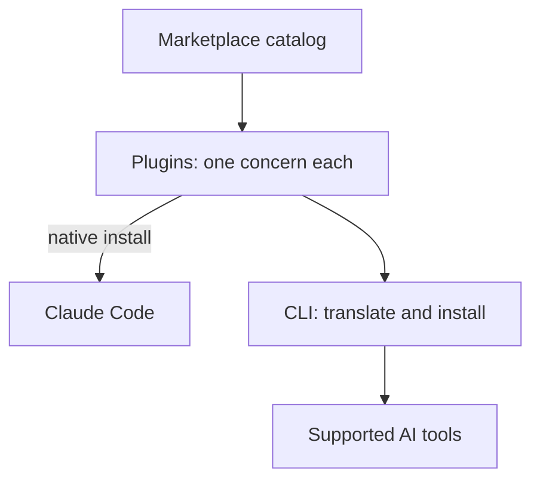
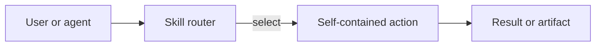

# Architecture

AIDD is a marketplace of plugins for AI-assisted work. Each plugin owns one concern; the AI tool loads its capabilities and executes the work.

## Marketplace and installation

The repository publishes a catalog in `.claude-plugin/marketplace.json`: it lists plugins and where to find them. Each `plugins/<name>/` package has its own manifest and version. The marketplace and plugins version independently.

Registration, installation scopes and updates are covered in the [marketplace guide](MARKETPLACE.md).

Plugins use Claude Code's native format. The CLI translates and installs them for supported AI tools; unavailable surfaces are reported, not silently ignored.

```mermaid
flowchart TB
  Catalog["Marketplace catalog"] --> Plugins["Plugins: one concern each"]
  Plugins -->|native install| Claude["Claude Code"]
  Plugins --> CLI["CLI: translate and install"]
  CLI --> Tools["Supported AI tools"]
```

`aidd-ui` is alpha and smoke-test only; `aidd-qa` requires validation outside this repository; `aidd-telemetry` is beta and opt-in. All remain outside curated installation.

## 🧩 Anatomy of a plugin

AIDD plugins contain a manifest and skills. Other capabilities are optional; they need not all be present in one plugin.

| Component | Location | Role |
| --- | --- | --- |
| Manifest | `.claude-plugin/` | `plugin.json` identifies the plugin, its version and declared capabilities. |
| Skill | `skills/<name>/SKILL.md` | Entry point that routes a request to actions or a protocol. |
| Actions | `skills/<name>/actions/` | Workflow steps with inputs, outputs, instructions and checks. |
| Assets | `skills/<name>/assets/` | Templates and static files used by the skill. |
| References | `skills/<name>/references/` | Supporting documentation and protocols, including orchestration handoffs. |
| Agents | `agents/` | Specialized roles that perform isolated work and return a result. |
| Commands | `commands/` | Flat prompts invoked as slash commands. |
| Hooks | `hooks/hooks.json` and scripts in `hooks/` | Programs triggered by tool lifecycle events. |
| MCP configuration | `.mcp.json` | Connects the AI tool to external tools and data through Model Context Protocol servers. |
| Documentation | `README.md` · `CATALOG.md` · `CHANGELOG.md` | Usage, capability inventory and release history. |

Rules govern project behavior in the host's rules directory, such as `.claude/rules/`. `aidd-context` generates them as project context, outside native Claude plugin surfaces. Native component behavior is defined in the [Claude plugin reference](https://code.claude.com/docs/en/plugins-reference).

Package validation

[Plugin](https://www.schemastore.org/claude-code-plugin-manifest.json) and [marketplace](https://www.schemastore.org/claude-code-marketplace.json) manifests are validated by `lefthook` and the `validate` workflow. Plugin tests belong in `scripts/__tests__/`, outside shipped trees: `hooks/` is copied recursively into user projects.

## Responsibilities

This table is the canonical placement map: put a capability in its owning concern and delegate to it.
| Plugin              | Concern              | Layer        |
| ------------------- | -------------------- | ------------ |
| `aidd-context`      | Knowledge production | Knowledge    |
| `aidd-pm`           | Product management   | Knowledge    |
| `aidd-refine`       | Meta-cognition       | Knowledge    |
| `aidd-dev`          | Code transformation  | Execution    |
| `aidd-vcs`          | Version control      | External     |
| `aidd-orchestrator` | Orchestration        | Coordination |
| `aidd-ui` 🚧        | UI/UX design         | Execution    |
| `aidd-telemetry` 🧪 | Measurement          | Observation  |
| `aidd-qa` 🆕         | Acceptance QA        | Execution    |

### Layer boundaries

- **Knowledge** produces context and specifications, never writes or runs application source. Context bootstrap creates no `package.json`.
- **Execution** changes or validates source. **External** owns version control.
- **Coordination** sequences work through artifacts (for example `INSTALL.md`), keeping domain logic and artifact contracts with their owning plugins. Direct and orchestrated calls obey the same contracts; the backlog flow belongs to `aidd-orchestrator:02-backlog`.
- **Observation** records work without changing the artifacts it describes. No productive flow depends on it.

### Measurement boundary

Telemetry requires committed `.aidd/config.json` with `telemetry.enabled: true`; a directory grants no permission. Session journals are git-ignored, append-only observations. Readers derive task identity and join provider measurements. See the [journal contract](../aidd_docs/runs/README.md).

## Execution model

### Skills and actions

The host loads `SKILL.md` on invocation. The caller follows its selected action or orchestration protocol.

```mermaid
flowchart LR
  Caller["User or agent"] --> Router["Skill router"]
  Router -->|select| Action["Self-contained action"]
  Action --> Result["Result or artifact"]
```

An orchestrator can follow a reference protocol instead of an action, with explicit handoffs to discovered providers.

### Agents and delegation

Choose by context: a **skill** runs in its caller's context; an **agent** isolates work and returns a result.

- Orchestrators retain routing ownership and authorize isolated work or bounded fan-out. Recipes never invent spawning; isolated recipes never delegate flow work.
- Agents invoke only their declared canonical recipe skills, never orchestrators, and never read skill files.
- Read-only reconnaissance may be delegated only to helpers that neither mutate nor spawn. The write path stays two layers deep, without delegation cycles.

The SDLC owns planning. Its [delivery](../plugins/aidd-orchestrator/skills/01-sdlc/references/02-deliver.md) and [check](../plugins/aidd-orchestrator/skills/01-sdlc/references/03-check.md) contracts govern direct execution, leaf executors, independent judgment and bounded repair.

### 🪝 Bundled hooks

Hooks declare deterministic lifecycle work in `hooks/hooks.json`. Repeated event work runs as dependency-free Node scripts and requires `node` on `PATH`.
| Plugin           | Event                                   | Runs                     | Purpose                                                     |
| ---------------- | --------------------------------------- | ------------------------ | ----------------------------------------------------------- |
| `aidd-context`   | `SessionStart`                          | `hooks/update_memory.js` | Refresh the project memory block in the AI context files    |
| `aidd-telemetry` | `SessionStart` · `Stop` · `PostToolUse` | `hooks/journal.cjs`      | Journal every session so a unit of work can be tied to its cost |

### CLI queries

Queries and reports use one CLI implementation, preventing duplicated logic. CLI-backed skills must explicitly report a missing `aidd`; the [dependency guard](../scripts/__tests__/telemetry-cli-required.test.js) enforces this.

## Portability

The CLI translates capabilities supported by each target. `aidd translate` skips rules and commands with a warning; the [CLI reference](../cli/README.md#translate) owns the output layout matrix.

### Skill portability

Skills link only inside their own directory: flat distribution renames them `<plugin>-<skill>`, while marketplace installation preserves the tree. Bundled scripts are named plugin-relative in backticks, never linked; the [portability guard](../scripts/__tests__/a-skill-links-only-inside-itself.test.js) verifies this.

### Hook adapters

The CLI owns OpenCode's shared host protocol; plugins own payload mapping. The [CLI architecture](../cli/ARCHITECTURE.md#hook-adaptation) defines adapter delivery and compatibility. [Telemetry coverage](../plugins/aidd-telemetry/README.md#coverage) states measurement limits.

## Capability discovery and addressing

Dispatch tables (`## Actions`) and agent permission lists (`# Skills you may invoke`) use canonical addresses. Elsewhere, name the responsibility.

Recipes discover cross-plugin providers by description rather than hardcoding siblings. Orchestration references and agent permissions name the current provider as `/plugin:folder` or `@plugin:agent`; orchestrators verify installation before dispatch.

`isExemptFromOrthogonality` exempts orchestration responsibility maps (`plugins/aidd-orchestrator/**`) and onboarding menus (`plugins/aidd-context/skills/00-onboard/**`). The onboarding exemption ends when it discovers providers at runtime.

## References

- [Framework README](../README.md): discover capabilities, install and start.
- [Marketplace guide](MARKETPLACE.md): registration, scopes and updates.
- [Create a plugin](CREATE_PLUGIN.md): authoring and publication.
- [Glossary](GLOSSARY.md): terminology.
- [CLI reference](../cli/README.md): commands and output layouts.
- [CLI architecture](../cli/ARCHITECTURE.md): translation and installation internals.
- [Contributing](../CONTRIBUTING.md): contribution flow.
- [Maintainers guide](MAINTAINERS.md): repository operations and releases.
