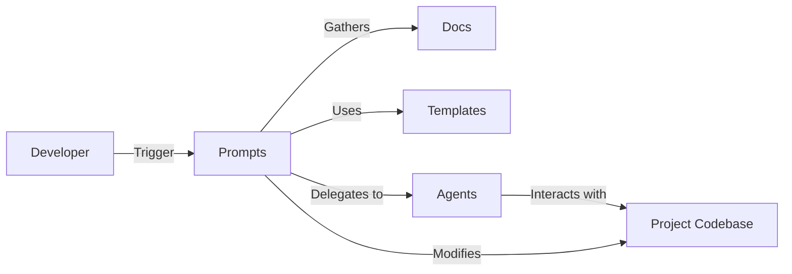

# Getting Started with AIDD CLI

- [Goal](#goal)
- [Key sections](#key-sections)
- [First Steps](#first-steps)
  - [1) Installation](#1-installation)
    - [Using NPM (recommended)](#using-npm-recommended)
    - [Downloading the source (security constraints apply)](#downloading-the-source-security-constraints-apply)
  - [2) Provide IDE support](#2-provide-ide-support)
  - [3) Initialize AIDD context engineering](#3-initialize-aidd-context-engineering)
  - [4) Binding all together testing your first feature](#4-binding-all-together-testing-your-first-feature)
  - [5) Personalization of your AI-Driven Development Flow (for your project)](#5-personalization-of-your-ai-driven-development-flow-for-your-project)

## Goal

Whereas you choose to install the CLI using the `npm` registry or by cloning the GitHub repository / downloading the zipped release, the goal do not change : apply the AI-Driven Dev framework to your projects.

The AIDD Framework will:

- [ ] 📦 Draw the Context Engineering architecture
- [ ] 📝 Help you to add proper content to it
- [ ] 🤖 Provide tested prompts that actually work
- [ ] 🚀 Bind it all together so AI is project context aware
- [ ] 👔 Personalize the AI-Driven Dev flow for YOUR codebase
- [ ] 🔄 Keep everything up to date with the latest AI innovations
- [ ] 🔥 Onboard the whole team in common best practices

## Key sections

As part of the AI-Driven Development framework, the idea is to bind AI contexts, prompts, agents and templates to your project's codebase.

| Type     | Description                                                                                       | Path                                               |
| -------- | ------------------------------------------------------------------------------------------------- | -------------------------------------------------- |
| Prompt   | Used as **action** that you can trigger from the CLI                                              | [cli/prompts](../../prompts/ide/)                  |
| Agent    | Used as **behavior delegation** that can be used asynchronously                                   | [cli/agents](../../prompts/templates/sub-agents/)  |
| Template | Used as **direction** to reduce hallucinations and guide the AI toward the goal, limiting entropy | [cli/prompts/templates](../../prompts/templates//) |
| Doc      | Your project's documentation, including rules, flows, and guidelines                              | [cli/docs](../docs/)                               |

## First Steps

### 1) Installation

#### Using NPM (recommended)

[README Installation Section](../README.md#installation)

#### Downloading the source (security constraints apply)

We highly recommend to use CLI as you will get the latest updates and bug fixes.

Nonetheless, if your organization has security policies that prevent you from using NPM packages, you can download the source code directly from the GitHub repository.

1. Go to the [AIDD CLI GitHub Repository](https://github.com/ai-driven-dev/aidd)
2. Click on the "Code" button and select "Download ZIP".
3. Extract the downloaded ZIP file to your desired location.

### 2) Provide IDE support

The CLI works with main AI-Driven Development IDEs (see [README](../README.md).

If you are NOT using the CLI, you will have to rely on [this course](../../training/courses/01_ai_driven_developer/0111_ide_mappings.md) to install the proper IDE support for your IDE.

- [ ] Copy `prompts/ide` contents to your IDE's AI prompts folder (e.g. `.claude/commands` for Claude Code).
- [ ] Copy `agents` contents to your IDE's AI agents folder (e.g. `.claude/agents` for Claude Code).
- [ ] Copy `prompts/templates` contents to your `aidd_docs/templates` folder in your project.

### 3) Initialize AIDD context engineering

We do provide modular AIDD context engineering architecture per module as independent clusters.

> This means, each module is independent and inherits from its parent module.

To initialize AIDD context engineering for your project, run the following command in your project's root directory:

```bash
/refresh_memory_bank
```

This will create a perfect `aidd_docs/` structure that you will need to carefully review.

```text
docs/
...
```

See [this course](../../training/courses/04_setup_environment/0402_context_structure.md) for more details.

### 4) Binding all together testing your first feature



This is great because now everything is setup and works together to provide the right context at the right time.

Try to test it with this commands flow:

```text
/plan
/implement
```

You must have proper plan generated and code implemented in your codebase with your rule.

> Hint : start with a VERY simple feature to validate the flow, this idea is NOT to build a complex feature at first, but to validate the AIDD flow is working properly.

### 5) Personalization of your AI-Driven Development Flow (for your project)

Once you made your first feature, the AIDD flow is now successfully setup!

> Using the AIDD context engineering structure made it scalable and maintainable across time, legacy codebase and huge repositories.

Now is time to personalize the AIDD flow for your project :

- [ ] Fill the `memory` of your projects
- [ ] Construct `rules` and quality gates specific to your project
- [ ] Add capabilities (`skills`) to your agents (you, or the `agents`)
- [ ] Customize `agents` behaviors to work inside the context of dedicated modules

If you do it properly, you will ONLY provide THE element that the AI needs to perform its task, and nothing more...
