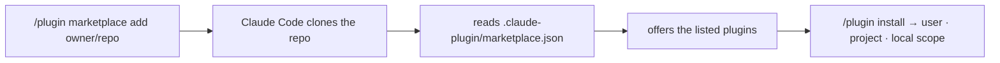

# Marketplace, scopes & versioning

Reference for how the `aidd-framework` marketplace is registered, scoped, and versioned.

## 🛒 How marketplaces work

A marketplace is a Git repo that publishes plugins. Run `/plugin marketplace add <owner>/<repo>` and Claude Code clones the repo, reads its `.claude-plugin/marketplace.json`, and offers the listed plugins.

`aidd-framework` is a community marketplace. It complements Anthropic's [official one](https://github.com/anthropics/claude-plugins-official) — register both, install from either.

Official Anthropic docs:

- [Discover and install plugins](https://code.claude.com/docs/en/discover-plugins) — user-facing flow
- [Plugin marketplaces](https://code.claude.com/docs/en/plugin-marketplaces) — host your own
- [Plugins reference](https://code.claude.com/docs/en/plugins-reference) — manifest + marketplace.json schemas

> **Private repo?** `/plugin marketplace add` needs read access (`gh auth login` or a PAT) — see the [install docs](https://code.claude.com/docs/en/discover-plugins).

## 🔧 Install scopes

Three scopes:

| Scope | Stored in | Lifetime | Best for |
| --- | --- | --- | --- |
| `user` | `~/.claude/plugins/` | All your projects | Personal toolbelt |
| `project` | `.claude/settings.json` (`enabledPlugins`) in the repo | This repo only | Team-shared setup |
| `local` | A local directory | This machine | Plugin development |

Set scope at install time via the `/plugin` UI, or edit `enabledPlugins` directly in `.claude/settings.json`.

## 🔖 Versioning & updates

- Each plugin and the root marketplace version independently via `release-please` (tags `<plugin>-vX.Y.Z`, root `vX.Y.Z`). Tooling → [`deployment.md`](../aidd_docs/memory/deployment.md).
- Pull updates inside Claude Code: `/plugin marketplace update aidd-framework`.
- Full history → [`CHANGELOG.md`](../CHANGELOG.md).
