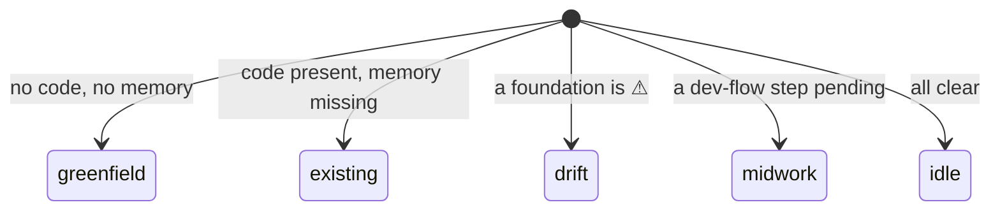

# Screen map

The state class picks the screen.

| State class | Screen                                                          |
| ----------- | -------------------------------------------------------------- |
| greenfield  | welcome + foundations, **stack first** (3 steps)               |
| existing    | welcome + foundations, **memory first** (2 steps, stack skipped) |
| drift       | welcome + the warning-with-fix                                 |
| midwork     | where-you-are on the flow + the next step                      |
| idle        | welcome + the flow (walk or SDLC), or the idle menu            |
