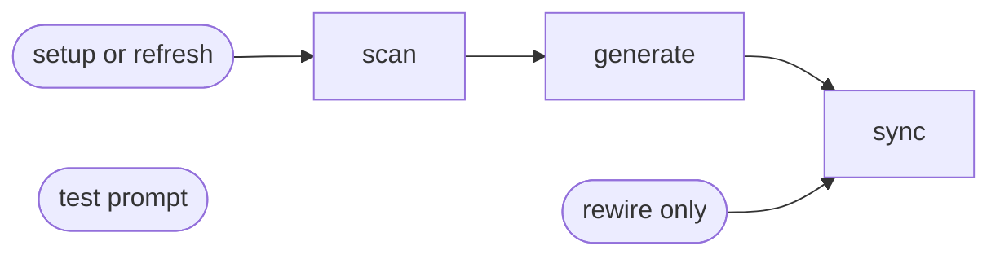

# Project Memory

## Actions

Run the flow above. No argument, `setup`, or `refresh` starts at scan. `rewire` runs sync alone. `test-prompt` runs alone. Read an action's file in `actions/` before running it.

| Action      | Does                                      |
| ----------- | ----------------------------------------- |
| scan        | read the project                          |
| generate    | write the memory                          |
| sync        | pick the tools, wire it in                |
| test-prompt | send one prompt for user judgment         |

## Transversal rules

- If a referenced file cannot be read, stop and say so. Never invent its content.
- Ask before anything ambiguous. Never default silently.
- Create or revise a file, keeping the user's edits. Delete one only when the user asks.
- After an action changes files, end with a short report of what changed.
