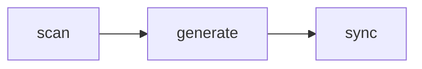

# Project Memory

## Actions

Run the actions in that order. Read an action's file in `actions/` before running it.

| #  | Action   | Does                       |
| -- | -------- | -------------------------- |
| 01 | scan     | read the project           |
| 02 | generate | write the memory           |
| 03 | sync     | pick the tools, wire it in |

Sync runs alone when the memory already exists and a tool needs wiring.

## Transversal rules

- Read an asset or reference relative to this skill.
- If one cannot be read, stop and say so. Never invent.
- Ask before anything ambiguous. Never default silently.
- End with a short report of what changed.
