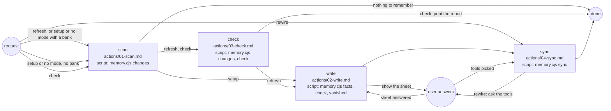

# Project Memory

## Actions

```mermaid
flowchart LR
  request((request)) -->|"refresh, or setup or no mode with a bank"| scan["scan<br>actions/01-scan.md<br>script: memory.cjs changes"]
  request -->|"setup or no mode, no bank"| scan
  request -->|"check"| scan
  request -->|"rewire"| sync["sync<br>actions/04-sync.md<br>script: memory.cjs sync"]
  scan -->|"setup"| write["write<br>actions/02-write.md<br>script: memory.cjs facts, check, vanished"]
  scan -->|"refresh, check"| check["check<br>actions/03-check.md<br>script: memory.cjs changes, check"]
  scan -->|"nothing to remember"| done((done))
  check -->|"refresh"| write
  check -->|"check: print the report"| done
  write -->|"show the sheet"| user((user answers))
  user -->|"sheet answered"| write
  write --> sync
  sync -->|"rewire: ask the tools"| user
  user -->|"tools picked"| sync
  sync --> done
```

Read an action's file, then do what it says.

## Transversal rules

- Speak only to ask or to give the final reply; otherwise call tools.
- After the sheet or the tool question, wait.
- Edit no memory file outside write.
- Run no version-control command: `changes` gives what changed.
