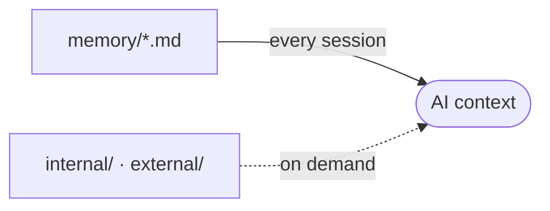

# memory/ - Project Memory

Structured context the AI assistant reads at the start of a session, so it does not rediscover the project each time.

## How it loads

The root files load every session through the `<aidd_project_memory>` block in each AI context file. `internal/` and `external/` load only when relevant.

## Files

Refreshed automatically by the memory hook. Do not edit by hand.

<!-- files:start -->
<!-- files:end -->

## Maintaining it

The AI writes and refreshes these files. When you edit one by hand:

- One file per concern (architecture, database, vcs, ...).
- Capture the macro and the non-derivable. Point to the code, never copy it.
- Current state only, kept small. No personal notes, no future TODOs.

## Subdirectories

- `internal/`: AIDD workflow traces (the capability profile, audit notes, learn captures).
- `external/`: external references the project pulls in (specs, design docs).
