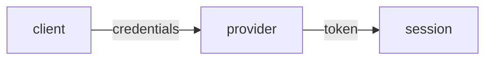

# Auth

How identity and access work: authentication and authorization.

## Authentication

- <The auth method (sessions, JWT, OAuth), the provider, where it is wired>

## Authorization

- <The model (roles, scopes, RBAC) and where it is enforced>

## Sessions

- <Token or session lifetime, refresh, storage>

<!--
Capture: the auth model and where it is enforced.
The diagram is the login-to-session flow, only when non-trivial (OAuth handoff, token refresh). A single session cookie needs none, drop it.
Skip: secret values, full middleware code. Remove this comment when filled.
-->
