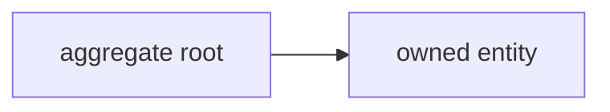

# Database

The data store: its type, the main entities, and the conventions. The macro model, not the full schema.

## Setup

- <Database type, ORM or driver, where the config lives>

## Main entities

The aggregate roots and how the main entities group: the design the schema does not show. Point to the schema file for columns and keys.

## Conventions

- <Migration tool and flow, seeding, naming>
- <Point to the auto-generated schema>

<!--
Capture: the DB choice, the domain grouping, the migration and seed conventions.
The diagram is the aggregate roots and bounded contexts, only when non-obvious. Never a column-level ER, it just restates the schema.
Skip: the full schema, every column. Point to the schema file. Remove this comment when filled.
-->
