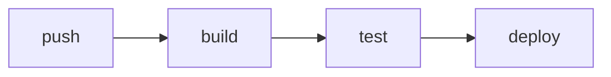

# Deployment

Where the project runs and how it ships: CI/CD, environments, and release.

## Pipeline

- <CI/CD tool, the macro stages (build, test, deploy)>
- <What triggers a deploy>

## Environments

- <The environments (dev, staging, prod) and their URLs>

## Release

- <How a release is cut, the rollback procedure>

## Monitoring

- <Monitoring and logging tools, where alerts go>

<!--
Capture: the macro pipeline, the environments, release and monitoring.
The diagram is the pipeline stages, only when it has real stages or gates. A one-step deploy needs none, drop it.
Skip: the full CI config, every env var. Point to the workflow files. Remove this comment when filled.
-->
