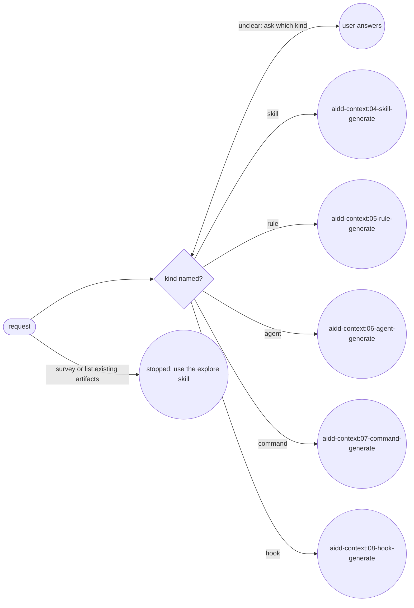

# Context Generate

```mermaid
flowchart LR
  entry([request]) --> kind{"kind named?"}
  kind <-->|"unclear: ask which kind"| user((user answers))
  kind -->|"skill"| skill((aidd-context:04-skill-generate))
  kind -->|"rule"| rule((aidd-context:05-rule-generate))
  kind -->|"agent"| agent((aidd-context:06-agent-generate))
  kind -->|"command"| command((aidd-context:07-command-generate))
  kind -->|"hook"| hook((aidd-context:08-hook-generate))
  entry -->|"survey or list existing artifacts"| stopped((stopped: use the explore skill))
```
