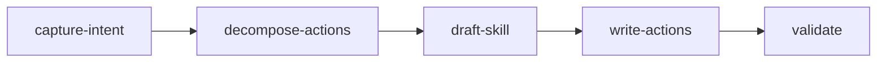

# Skill Generate

Builds one canonical skill from intent and renders it per confirmed host tool, or once as a plugin source.

## Actions

Run the flow above, and run each action's `## Test` before the next. Read an action's file in `actions/` before running it. In modify mode the tool is fixed by the existing skill's location, so the resolution gate is skipped.

| #   | Action              | Does                                        |
| --- | ------------------- | ------------------------------------------- |
| 01  | `capture-intent`    | clarify intent and tools, inventory overlaps |
| 02  | `decompose-actions` | break the skill into atomic testable actions |
| 03  | `draft-skill`       | write the SKILL.md router                    |
| 04  | `write-actions`     | write each action file from the template     |
| 05  | `validate`          | run each action's Test, aggregate pass/fail  |

## References

- `references/skill-authoring.md`: the contract (R1-R13, action anatomy, naming).
- `references/tool-paths.md`: per-tool skills path, frontmatter, resolution + write-safety gate.

## Assets

- `assets/skill-template.md`: SKILL.md scaffold.
- `assets/action-template.md`: canonical action scaffold.
