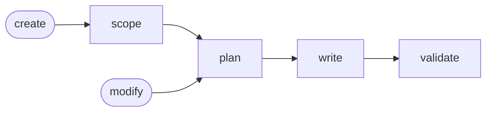

# Skill Generate

Default to `create`; follow `modify` when asked.

## Actions

Read only the next action's file before running it.

| #  | Action   | Does                       |
| -- | -------- | -------------------------- |
| 01 | scope    | frame the skill and target |
| 02 | plan     | break it into actions      |
| 03 | write    | write the router and files |
| 04 | validate | review the files and fix   |

## Transversal rules

- If a cited reference cannot be read, stop and report the missing file.
- Confirm every target and name with the user.
- Never write silently.
