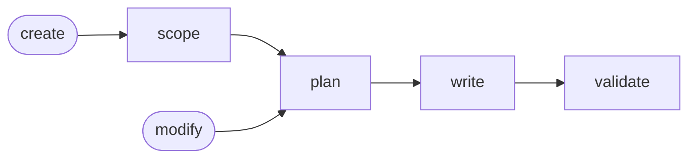

# Skill Generate


```mermaid
flowchart LR
  new([create]) --> scope --> plan --> write --> validate
  edit([modify]) --> plan
```

## Actions

Run the flow above. Read only the next action file.

| Action   | Does                       |
| -------- | -------------------------- |
| scope    | frame the skill and target |
| plan     | break it into actions      |
| write    | write the router and files |
| validate | review the files and fix   |

## Transversal rules

- Default to `create`; follow `modify` when asked.
- If a cited reference cannot be read, stop and report the missing file.
- Confirm every target and name with the user.
- Never write silently.

## Say when this skill's work is done

Once this skill has produced what it was called for, and only then, run:

```shell
echo "aidd:step-end aidd-context:04-skill-generate"
```

No host reports when a skill's work finished. A skill call's own result comes back in a
tenth of a second, which is the dispatch and not the completion, so a measurement that
never hears this ends the step where the next one begins — or, where none follows, at the
journal's own last witnessed moment, which credits this skill with everything the session
did afterwards.
