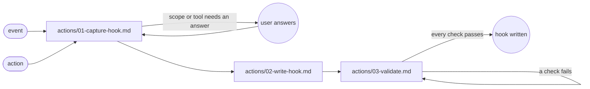

# Hook Generate

```mermaid
flowchart LR
  event([event]) --> capture["actions/01-capture-hook.md"]
  action([action]) --> capture
  capture -->|"scope or tool needs an answer"| user((user answers)) --> capture
  capture --> write["actions/02-write-hook.md"] --> validate["actions/03-validate.md"]
  validate -->|"a check fails"| validate
  validate -->|"every check passes"| done((hook written))
```
