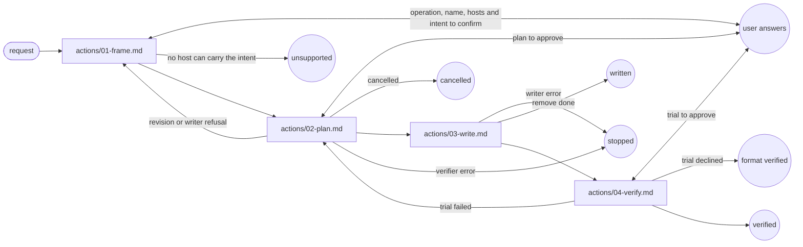

# Hook Generate

```mermaid
flowchart LR
  entry([request]) --> frame["actions/01-frame.md"]
  frame <-->|"operation, name, hosts and intent to confirm"| user((user answers))
  frame -->|"no host can carry the intent"| unsupported((unsupported))
  frame --> plan["actions/02-plan.md"]
  plan <-->|"plan to approve"| user
  plan -->|"revision or writer refusal"| frame
  plan -->|"cancelled"| cancelled((cancelled))
  plan --> write["actions/03-write.md"]
  write -->|"writer error"| stopped((stopped))
  write -->|"remove done"| done((written))
  plan -->|"verifier error"| stopped
  write --> verify["actions/04-verify.md"]
  verify -->|"trial failed"| plan
  verify <-->|"trial to approve"| user
  verify -->|"trial declined"| unverified((format verified))
  verify --> verified((verified))
```

## Transversal rules

- If a cited reference cannot be read, stop and report the missing file.
- Write the hook only in the project, never in a user or global scope.
