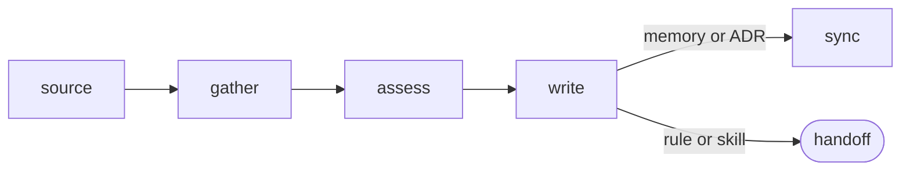

# Learn

## Actions

Run the matching path above. Read only the next action's file before running it.

| Action | Does |
| ------ | ---- |
| source | identify and challenge the origin |
| gather | read the origin and extract candidates |
| assess | score, reconcile, and confirm |
| write | write or hand off approved lessons |
| sync | refresh memory references |

## Transversal rules

- Write only the user-approved plan.
- Preserve user edits and touch affected files only.
- Write project files only, never personal or global memory, never scaffold `aidd_docs/memory/` yourself.
