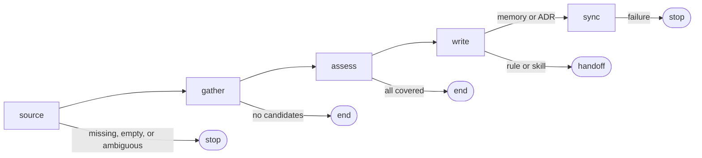

# Learn


```mermaid
flowchart LR
  source --> gather --> assess --> write
  source -->|"missing, empty, or ambiguous"| sourceStop([stop])
  gather -->|"no candidates"| gatherEnd([end])
  assess -->|"all covered"| assessEnd([end])
  write -->|"memory or ADR"| sync
  write -->|"rule or skill"| handoff([handoff])
  sync -->|"failure"| syncStop([stop])
```

## Actions

Run the flow above. Read only the next action file.

| Action | Does |
| ------ | ---- |
| source | identify and challenge the origin |
| gather | read the origin and extract candidates |
| assess | score, reconcile, show, and confirm |
| write | write or hand off approved lessons |
| sync | refresh memory references |

## Transversal rules

- Write only the user-approved plan.
- Preserve user edits and touch affected files only.
- Write project files only, never personal or global memory.

## Say when this skill's work is done

Once this skill has produced what it was called for, and only then, run:

```shell
echo "aidd:step-end aidd-context:10-learn"
```

No host reports when a skill's work finished. A skill call's own result comes back in a
tenth of a second, which is the dispatch and not the completion, so a measurement that
never hears this ends the step where the next one begins — or, where none follows, at the
journal's own last witnessed moment, which credits this skill with everything the session
did afterwards.
