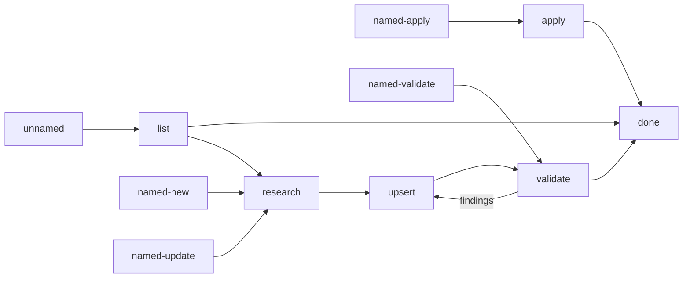

# Cook

Run the flow above. Read only the next action file.

| Action | Does |
| --- | --- |
| list | list project and bundled recipes |
| research | research one recipe or topic |
| upsert | create or update one recipe |
| apply | apply one existing recipe |
| validate | validate one or all recipes |

## Transversal rules

- Read the next action file before running it.
