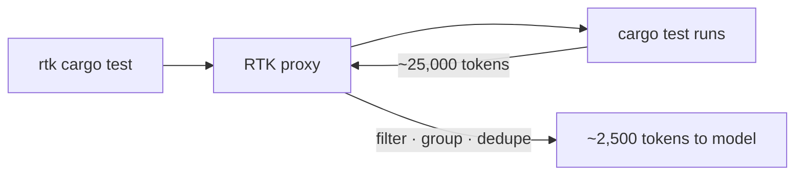

# Token optimization for AI IDEs

Cut token usage and cost in AI coding assistants without losing output quality.

## Why optimize your tokens

**Token usage** is the bill — every turn re-sends your whole **context window** and you pay for it again.

Most of it is **waste**: filler prose, noisy logs, stale context, bloated instruction files.

Reach for this recipe when **cost** climbs faster than your output.

## Steps to cut token usage

### 🟢 Beginner

#### 1) 🔎 See what fills the window — `/context`

`/context` paints your context as a grid, so you cut the biggest consumers instead of guessing.

1. Run `/context` in Claude Code.
2. Find the heavy blocks: tool schemas, instruction files, long file reads.
3. Attack the biggest block first.

```text
$ /context
  MCP tool schemas   ████████████  28%   ← biggest, cut first
  file reads         ████████      19%
  CLAUDE.md          ████          9%
(illustrative — replace with a screenshot of your real /context)
```

#### 2) 💸 Read the bill — `/cost`

`/cost` tells you what a session actually costs and where the spend goes.

1. Run `/cost` (alias `/usage`).
2. Read the breakdown by skill, subagent, and MCP server.
3. Re-run it after a change to confirm the spend really dropped.

```text
$ /cost
  Session: $0.42 · 1.2M tokens
  By: subagents 38% · MCP 21% · main 41%
(illustrative — replace with a screenshot of your real /cost)
```

#### 3) 🔍 Find your bad habits — `/insights`

`/insights` analyses how you prompt — probably sub-optimal — so you fix the pattern, not one prompt. What you repeat every session belongs in the knowledge base, and the counter-intuitive habits you never noticed get surfaced so you can drop them.

1. Run `/insights`.
2. Move what you repeat into `CLAUDE.md` or a rule, and drop the habits it flags.

```text
$ /insights
  • You restate the test command in ~60% of sessions → put it in CLAUDE.md
  • Long "summary" turns inflate output → ask for terse replies
(illustrative — replace with a screenshot of your real /insights)
```

#### 4) 📈 Track per-prompt with an analytics tool

Built-ins show one session; an analytics tool reads all your local logs and reveals where the bill truly sits. The lesson it surfaces: **cache reads dwarf input + output**, so caching, not generation, is most of the bill.

1. Pick one: [`prompt-analytics-for-claude-code`](https://github.com/romainfjgaspard/prompt-analytics-for-claude-code) or [`ccusage`](https://www.npmjs.com/package/ccusage).
2. Run it — `uvx --from prompt-analytics-for-claude-code prompt-analytics summary` — no setup, it parses `~/.claude`.


#### 5) ✂️ Trim your instruction file

Your instruction file ships every turn, so each cut line saves on every message.

1. Open `CLAUDE.md` (or `.github/copilot-instructions.md`).
2. Cut it to essentials and add explicit conciseness rules.
3. Model it on a real concise instruction file: [AGENTS.md](../../../02-project-memory/assets/AGENTS.md).

```md
# CLAUDE.md — keep it terse (see AGENTS.md for the full example)
- Answer first. Lead with the result, then the reason. Drop pleasantries and hedging.
- No tool-call narration. No decorative tables or emoji unless they carry information.
- Keep verbatim: code, quoted errors, security warnings. Cut the rest.
```

#### 6) 🧭 Plan before you edit — plan mode

Approving the wrong direction burns tokens on rework, so let Claude explore read-only and propose a plan first.

1. Press `Shift+Tab` twice to enter plan mode (or start with `claude --permission-mode plan`).
2. Review the plan, then approve to switch to execution.

```text
Shift+Tab Shift+Tab → ⏸ plan mode
  Claude reads and proposes; no edits until you approve
```

See [permission modes](https://code.claude.com/docs/en/permission-modes).

#### 7) ♻️ Clear context between tasks — `/clear`

Stale early turns ride along and get re-billed every turn, so reset when the task changes.

1. Finish a task, then run `/clear` to drop the history and reload only `CLAUDE.md` and memory.
2. Use `/compact` instead when you want to keep a summary of the same task.

```text
$ /clear
  history dropped → fresh window, CLAUDE.md + memory reloaded
```

See [reduce token usage](https://code.claude.com/docs/en/costs).

#### 8) 🗜️ Compact deliberately

Compacting on your terms keeps what matters instead of letting auto-compaction guess.

1. Watch context use and act around 60–70%.
2. Run `/compact` with focus instructions naming what to keep.

```text
$ /compact keep the repro steps and the failing test; drop the file dumps
```

### 🟡 Intermediate

#### 9) 🗣️ Make the agent talk less

Output is repetition you pay to generate, so cap the chatter. caveman forces short, filler-free replies (reported ~65% output cut, code intact) and auto-detects 30+ agents.

1. Built-in route: set `"outputStyle": "concise"` in `settings.json`.
2. Harder cut: install the [`caveman`](https://github.com/JuliusBrussee/caveman) skill and invoke it like any skill — `/caveman` (or `/caveman ultra`); stop with "normal mode".

```text
/caveman

before: The reason your React component is re-rendering is likely because you're creating a new object reference on each render cycle. When you pass an inline object as a prop, React's shallow comparison sees it as a different object every time, which triggers a re-render. I'd recommend using useMemo to memoize the object.

after:  New object ref each render. Inline object prop = new ref = re-render. Wrap in `useMemo`.
```

See [output styles](https://code.claude.com/docs/en/output-styles).

#### 10) 🧹 Filter noisy command output

Test, install, and build logs flood context with lines the model never needs.

1. Install a CLI proxy: [`RTK`](https://github.com/rtk-ai/rtk) (Rust) or [`SNIP`](https://github.com/edouard-claude/snip) (Go, YAML filters).
2. Prefix your command with it: `rtk cargo test`.



Real saving: `git push` (15 lines, ~200 tokens) -> `rtk git push` (1 line, ~10 tokens).

#### 11) 🚫 Keep big paths out of context — deny reads

Vendor dirs, build output, and secrets get pulled into context by accident. Deny reads on them so they stay out — they remain grep-able.

1. In `settings.json`, add `Read(...)` deny rules for large or sensitive paths.
2. `.claudeignore` is not shipped — deny rules are the official way.

```json
{
  "permissions": {
    "deny": ["Read(./vendor/**)", "Read(./dist/**)", "Read(./.env)"]
  }
}
```

See [permissions](https://code.claude.com/docs/en/permissions).

#### 12) 🔌 Prefer CLI over MCP

An MCP server's schema rides along every turn; a CLI costs tokens only when you call it. Newer MCP tooling adds tool/context selection that loads only the tools you pick — cheaper than before — but a CLI is still leaner and faster.

| | CLI (`gh`, `acli`, …) | MCP server |
| --- | --- | --- |
| Token cost | a few, only when called | a schema every turn; less with tool/context selection |
| Speed | fastest | slower |
| Use when | a CLI exists | no CLI, or you need typed/live tool calls |

See [`mcp-installation.md`](mcp-installation.md).

### 🔴 Expert

#### 13) 🔬 Audit which skills and tools run — `Ctrl+O`

You optimise what you can see, so expand the transcript to watch what each turn actually invokes and pulls into context.

1. Press `Ctrl+O` to toggle the transcript — it shows detailed tool and skill usage and expands collapsed MCP calls.
2. Spot skills or tools that load on turns that don't need them, then scope or remove them.

```text
Ctrl+O — transcript expanded
  ⎿ Skill: token-optimization
  ⎿ Called slack 3 times → expanded: 3 tool calls
(illustrative — replace with a screenshot of your real Ctrl+O transcript)
```

See the [keyboard shortcuts](https://code.claude.com/docs/en/interactive-mode).

#### 14) 🎯 Route by difficulty

The top model on routine work is wasted spend, so pin the model per skill or agent — cheap for routine, top-tier for hard reasoning.

1. Set `model` in a skill's or an agent's frontmatter (`haiku` / `sonnet` / `opus`, a full id, or `inherit`).
2. Give routine scouts a small model; reserve `opus` for the hard reasoning.

```yaml
# .claude/agents/explore.md — routine scouting on a cheap model
---
name: explore
description: Read-only codebase scout
tools: Read, Grep, Glob
model: haiku
---
```

A skill's `SKILL.md` takes the same `model:` field (e.g. `model: opus` for a heavy step). See [sub-agents](https://code.claude.com/docs/en/sub-agents) and [skills](https://code.claude.com/docs/en/skills).

#### 15) 🧫 Offload high-volume work to subagents

Test runs, log parsing, and wide exploration flood the main window. A subagent does it in its own context and hands back only a summary, so the bloat never lands in your session.

1. Define an agent in `.claude/agents/<name>.md` with only the tools it needs and a small `model`.
2. Let it run the noisy op and return a short result.

```yaml
# .claude/agents/test-runner.md
---
name: test-runner
description: Run the suite and return only the failures
tools: Bash, Read
model: haiku
---
```

See [sub-agents](https://code.claude.com/docs/en/sub-agents).

#### 16) 🧊 Protect your cache hits

Cached input bills far cheaper, and cache reads are most of your tokens (step 4) — so don't throw the cache away mid-task. A model switch, an MCP connect or disconnect, or an effort change rebuilds it from scratch.

1. Set the model and reasoning effort at the start of a task, not mid-work.
2. Switch model or toggle MCP servers only at task boundaries, where a cache rebuild is acceptable.

```text
mid-task model switch → cache invalidated → full re-bill
same model to a boundary → cache reads stay cheap
```

See [prompt caching](https://code.claude.com/docs/en/prompt-caching).

#### 17) ✅ Cap extended thinking

Extended reasoning can silently add thousands of tokens on tasks that don't need it.

1. In `settings.json`, set `MAX_THINKING_TOKENS` to `0` for routine work.
2. See the [Claude Code settings docs](https://code.claude.com/docs/en/settings).

```json
{
  "env": {
    "MAX_THINKING_TOKENS": "0"
  }
}
```

## In short

Measure first, then stack the cheap wins — trimmed instructions, plan mode, a clean context, less chatter, filtered output — before the advanced routing, subagents, and cache discipline. Most of the bill is cache and repetition; cut those and the cost follows.
