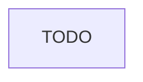

<!-- Phase contract: phase-<n>.md next to plan.md · status starts pending · projection is this phase's slice as a tree (❌ delete, ✅ create, 🔁 rename) · every task has one deterministic acceptance criterion a command can check · embed the confirmed wireframe when there is one · English, lists and tables over prose. -->

# Phase: {title}

Part of [`plan.md`](./plan.md).

## Architecture projection

```txt
.
```

## User journey



## Tasks

### {n}) {name}

> {goal, straight to the point}

1. {ultra concise step}

## Acceptance criteria

| Task | Criterion                     |
| ---- | ----------------------------- |
| 1    | {focused deterministic check} |
