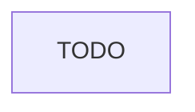

# Instruction: {title}

| Element         |  Value          |
| --------------- | --------------- |
| **Plan**        | `{plan}/`       |
| **Branch name** | `{branch-name}` |

## Architecture projection

<!-- Validated projection using tree to preview the final architecture:  use # ❌ when deleted, ✅ when created, 🔁 when renamed and files/folders -->

```txt
.
```

## User Journey

<!-- A short demo showing the feature works end-to-end, what a REAL user would do to 100% validate the feature. -->



## Tasks to do

### `{number})` {name}

> {straight to point goal}

<!-- Including wireframe if chosen -->

1. {ultra concise step}
   ...

## Test acceptance criteria

| Task | Acceptance criteria                  |
| ---- | ------------------------------------ |
| 1... | {focused deterministic verification} |
