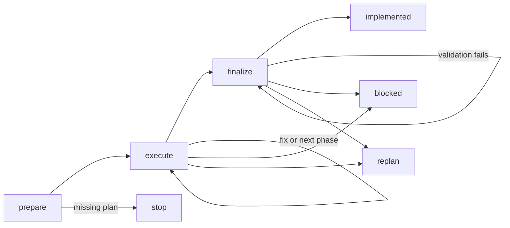

# Skill: implement

## Actions

Run in order; read each action file in `actions/` before executing it.

| Action   | Does                                  |
| -------- | ------------------------------------- |
| prepare  | resolve the plan and branch            |
| execute  | implement and validate each phase      |
| finalize | validate and mark the plan implemented |

## Transversal rules

- Status: plan `pending → in-progress → implemented` (or `blocked`); phases `pending → in-progress → done`. `in-progress` is a runtime marker.
- Commits: one per phase, code and `done` together; one final commit for `implemented`. Keep phase boundaries clean; never commit `in-progress` alone.
- Formatting: never format code manually; use project formatters or hooks.
