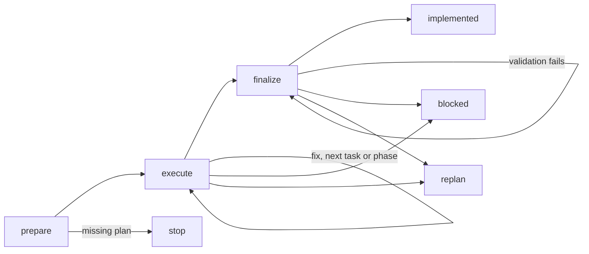

# Skill: implement

## Actions

Run actions in order.
Read each action file in `actions/` before executing it.

| Action   | Does                                  |
| -------- | ------------------------------------- |
| prepare  | resolve the plan and branch            |
| execute  | implement and validate each task       |
| finalize | validate and mark the plan implemented |

## Transversal rules

- Track the plan through `pending → in-progress → implemented` (or `blocked`).
  - Track phases through `pending → in-progress → done`.
  - Treat `in-progress` as a runtime marker.
  - Never commit `in-progress` alone.
- Follow user and project commit instructions.
  - Otherwise, commit locally at the boundaries below.
  - Push only when requested.
- Make one commit per validated task.
  - Include all its code, tests and docs together.
  - Group tasks only when they cannot be validated separately.
  - Never split a task by step or file.
  - Exclude unrelated changes.
- Include `done` in the phase's last task commit.
- Make a final commit for `implemented`.
- Use project formatters or hooks.
  - Never format code manually.
