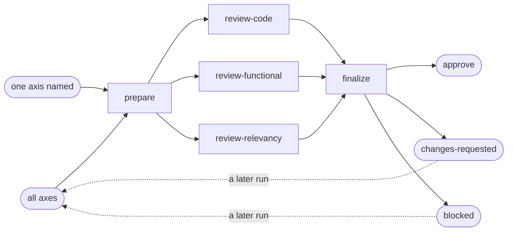

# Review

## Actions

Run the flow above, reading only the next action file.

| Action | Does |
| --- | --- |
| prepare | resolve the diff and open the round |
| review-code | grade the changed lines on clean code |
| review-functional | trace the diff against the plan's criteria |
| review-relevancy | judge whether the change belongs |
| finalize | judge the round and check its shape |

## Transversal rules

- Ask which entry the caller wants when the request does not say.
- Review statically: never run the app.
