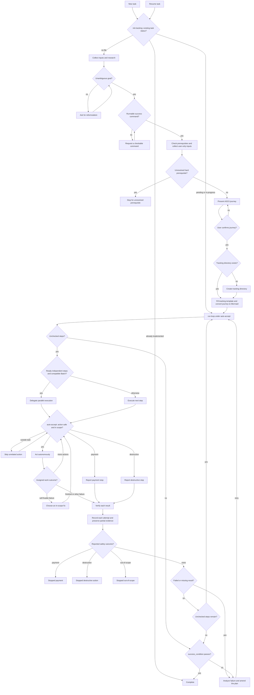

# Goalify

## Actions

Read [tracking setup](actions/01-init-tracking.md) first.

| Action | Does |
| --- | --- |
| init-tracking | frame the goal, create or resume tracking, launch the loop |
| auto-accept | decide and act within the task's safety limits |
| run-loop | dispatch workers, verify evidence, replan failures, check completion |

## Transversal rules

- Keep all task state in `aidd_docs/tasks/<task-name>.md` and nowhere else.
- Never retry a failed approach without a meaningful change.
- Apply the [autonomy rules](actions/02-auto-accept.md) throughout unattended execution.
- Delegate execution to one leaf worker per step, directly or through a discovered parallel capability.
  - Keep parallel dispatch in the orchestrator's context, without another controller agent.
  - Retain planning, safety decisions, per-item verification, and retries.
  - Never perform the workers' execution yourself.
  - Workers execute only their assigned step and return evidence.
- Select models by responsibility.
  - Use a powerful available model for framing, planning, verification, and replanning.
  - Apply that selection to every orchestrator launch or resume.
  - At every worker launch or relaunch, use the smallest available model with its highest supported reasoning effort.
