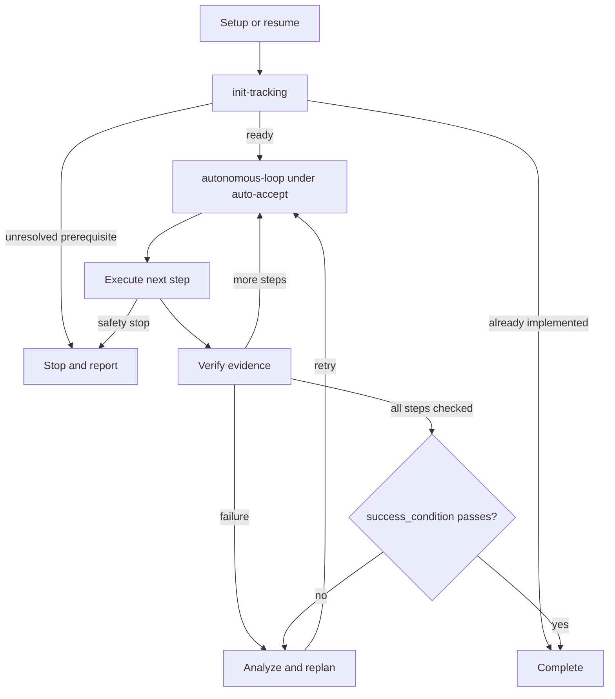

# Skill: goalify

Frame a checkable goal interactively, then run unattended until its success condition passes or a safety stop is reached.

## Actions

| Action | Does |
| --- | --- |
| [init-tracking](actions/01-init-tracking.md) | frame the goal, create or resume tracking, launch the loop |
| [auto-accept](actions/02-auto-accept.md) | decide and act within the task's safety limits |
| [autonomous-loop](actions/03-autonomous-loop.md) | dispatch workers, verify evidence, replan failures, check completion |

Run `init-tracking` interactively; it launches or resumes `autonomous-loop` under `auto-accept`.
Before running an action, read its file in `actions/`, not only the table or assets.

## Transversal rules

- Single source of truth: all task state lives in `aidd_docs/tasks/<task-name>.md` and nowhere else.
- No repeated failures: never retry a failed approach without a meaningful change.
- Honesty over escape: never set `status: implemented` until the success condition genuinely passes.
- Auto-accept: follow the action's rules within the original task; stop on payment or destructive actions.
- The loop spawns one worker agent per step and never does the work itself.
- Model policy: use a powerful available model for framing, planning, verification, and replanning, including every orchestrator launch or resume. At every worker launch or relaunch, use the smallest available model with its highest supported reasoning effort. Workers execute only their assigned step and return evidence.

## Assets

- `assets/plan-template.md`: the tracking file format (frontmatter, phases, acceptance criteria, Log).
- `assets/autonomous-loop-worker-prompt.md`: the prompt the loop spawns each per-step worker with.

## References

- `references/autonomous-loop-log-format.md`: the Log entry format the loop appends per attempt.
