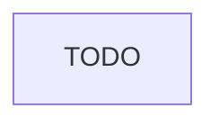

<!--  AI INSTRUCTIONS ONLY -- Follow those rules, do not output them.

- ENGLISH ONLY
- Use concise bullet points without decorative styling.
- Omit decorative emojis but retain required execution amendment markers.
- Fill placeholders and examples from confirmed user inputs and verified project context.
- Replace sample paths, example commands, and the journey's TODO node with task-specific content.
- Repeat phases as needed and remove unused examples.
- Use `none` for inapplicable fields or sections.
- Start Amendments and Log empty for new tasks; preserve their history when resuming.
- Remove all scaffold HTML comments, including this block and inline comments, from the produced file.
- Leave no unfilled placeholder, sample path, example command, ellipsis, or TODO node.
- Each phase MUST have acceptance criteria.
- This file IS the live tracking file for Goalify. State lives in the `status` frontmatter field (`pending → in-progress → implemented`).
-->

# Instruction: {title}

## Feature

- **Summary**: {Summarize feature based plan, goal oriented}
- **Stack**: `[TECH_STACK_WITH_VERSIONS]` <!-- Output all stacks that will be used! -->
- **Branch name**: `{suggested-branch-name}`
- **Parent Plan**: `{master-file}` or `none`
- **Sequence**: `{N of M}` or `standalone`
- Confidence: {Confidence}
- Time to implement: {Time to implement}

## Architecture projection

<!-- Validated with the user before plan finalization. -->

### Files to modify

- `path/to/file.ts` - {one-line reason}

### Files to create

- `path/to/new-file.ts` - {one-line purpose}

### Files to delete

- `path/to/dead.ts` - {one-line reason}

## Applicable rules

<!-- Generated by the project's rule-inventory step. The checker uses this list to verify the implementation. `none` if no installed tool has rules. -->

| Tool   | Name   | Path                                  | Why it applies |
| ------ | ------ | ------------------------------------- | -------------- |
| {tool} | {slug} | `<tool rules root>/<cat>/<slug>.<ext>` | {short reason} |

## User Journey

## Risk register

<!-- Top technical risks that could derail implementation. Identify them upfront so the plan accounts for them. -->

| Risk     | Impact                        | Mitigation                            |
| -------- | ----------------------------- | ------------------------------------- |
| {risk 1} | {what breaks if this happens} | {how the plan prevents or handles it} |

## Implementation phases

### Phase {n}: {name}

> {straight to point goal}

#### Tasks

1. {ultra concise task1, with logical ordering}
2. {...}
3. {...}

#### Acceptance criteria

- [ ] {verifiable boolean condition 1}
- [ ] {verifiable boolean condition 2}

## Amendments

<!-- Format execution amendments using the [loop instructions](../actions/03-run-loop.md). -->

## Log

<!-- Read and apply the [Log format](../references/autonomous-loop-log-format.md) when appending each step attempt. -->

## Validation flow demonstration

<!-- A short demo showing the feature works end-to-end, what a REAL user would do to 100% validate the feature. -->

1. {Step 1...}
