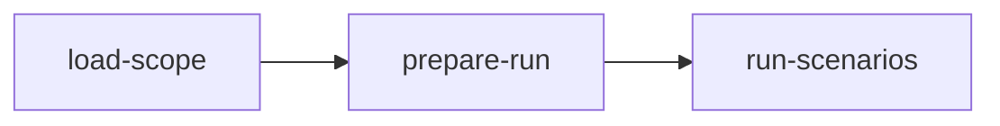

# QA

## Actions

Read only the next action's file before running it.

| #   | Action          | Does                                                       |
| --- | --------------- | ---------------------------------------------------------- |
| 01  | `load-scope`    | Lock one happy path and a bounded set of sourced edge cases |
| 02  | `prepare-run`   | Resolve the shortest deterministic path to executable runs |
| 03  | `run-scenarios` | Record, normalize, verify, reset, and report every scenario |

## Transversal rules

- Run against a reviewed change and never patch the application.
- Never spawn agents. Batch independent reads and tool checks, but keep state-changing browser work sequential.
- Do not narrate action transitions, searches, fixtures, selectors, or successful checks. Report only a blocker, a required decision, or the final verdict and paths.
