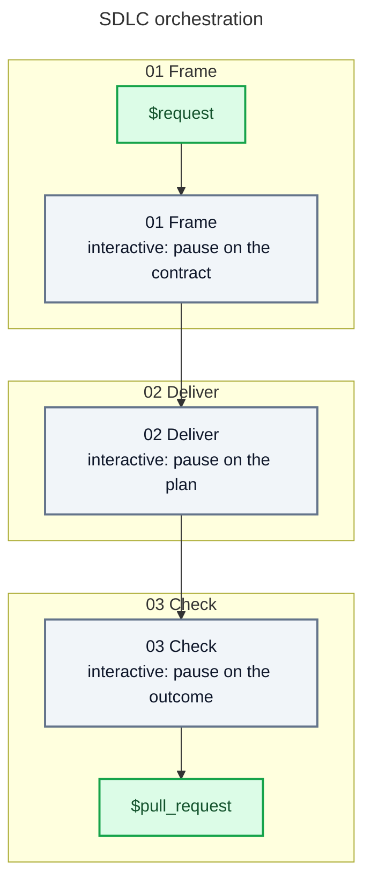

# Skill: sdlc

## Behavior

The mode is `auto` unless the caller asks for `interactive`, named as the request's first whole word and no part of the source. A request carrying nothing else is not one to run; say so and stop.

In `auto`, operate autonomously from the request to a draft pull request: decide and act without confirmation, asking only before spending money, taking an irreversible action, or making a decision that requires user authority. An exception stops the action it guards, not the rest of the request. Say what was withheld and what would release it.

In `interactive`, pause on the contract, on the plan, and on the outcome before the pull request opens. Present what was produced and wait. Dispatch in `interactive` only the steps that produce those three, clarifying and formalizing included, and the rest in `auto`. A spec is how Frame formalizes the contract, not a fourth artifact. Every wait a step takes is that artifact's pause; where it takes none, pause yourself. An artifact produced anew pauses again. An approval ships what was presented.

A refusal at a pause is a finding against that artifact. Contract or spec to Frame, plan to Deliver, outcome to Deliver or to Frame when it changes what is being built. It routes by artifact, never by a finding's kind, and travels with the source. Say so and wait again when it names what the artifact already carries. Only the user bounds this loop.

A zone that cannot proceed stops the run and says what it would take to resume. Read only the current zone reference. Verify that every named provider is installed before calling it.

Spawn specialized agents for isolated work. Parallelize independent work when it is faster. Give each agent one focused task that a smaller model can execute. Repeat the responsible zone when delegated work returns an actionable gap.



## Say when this orchestration is over

Once the draft pull request exists, and only then, run:

```shell
echo "aidd:step-end aidd-orchestrator:01-sdlc"
```

No host reports when an orchestration finished. A skill call's own result comes back in a
tenth of a second, which is the dispatch and not the completion, so a measurement that never
hears this ends the run at the next pause — and an orchestration is mostly pauses. Everything
it drove afterwards then reads as work that belonged to nothing.

## References

| #   | Reference                               |
| --- | --------------------------------------- |
| 01  | [Frame](references/01-frame.md)         |
| 02  | [Deliver](references/02-deliver.md)     |
| 03  | [Check](references/03-check.md)         |
