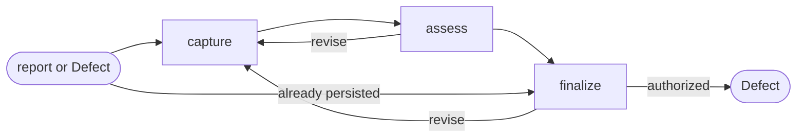

# Defect



## Actions

Run the flow above. Read only the next action file.

| Action   | Does                                      |
| -------- | ----------------------------------------- |
| capture  | frame one observed product mismatch       |
| assess   | establish evidence, impact, and readiness |
| finalize | persist or transition the Defect           |

## Transversal rules

- Keep product and lifecycle decisions with the user.
- Separate evidence, decisions, and assumptions.
- Preserve source links and existing edits.
- Ask natural questions; never expose actions, references, or unchanged state.
- Require explicit approval or caller-provided bounded authority before any write.
- Record the mismatch; never diagnose or implement its fix.

## Say when this skill's work is done

Once this skill has produced what it was called for, and only then, run:

```shell
echo "aidd:step-end aidd-pm:09-defect"
```

No host reports when a skill's work finished. A skill call's own result comes back in a
tenth of a second, which is the dispatch and not the completion, so a measurement that
never hears this ends the step where the next one begins — or, where none follows, at the
journal's own last witnessed moment, which credits this skill with everything the session
did afterwards.
