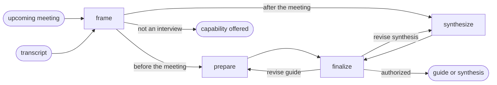

# Interview

## Actions

Run the flow above. Read only the next action file.

| Action     | Does                                          |
| ---------- | --------------------------------------------- |
| frame      | resolve the route and the meeting context     |
| prepare    | build an interview guide for one meeting      |
| synthesize | restructure one transcript by question asked  |
| finalize   | revise, anonymize, keep, or persist           |

## Transversal rules

- Keep conclusions and product decisions with the user.
- Never invent a quote, figure, name, or context field; ask for it or mark it unknown.
- Anonymize personal data in every output once the user asks for it.
- Accept transcripts as pasted text or files from any meeting or dictation tool; depend on none.
- Emit plain Markdown that pastes into a wiki or ticketing tool unchanged.
- Ask natural questions, one at a time; never expose actions, references, or unchanged state.
- Require explicit approval before any write.
