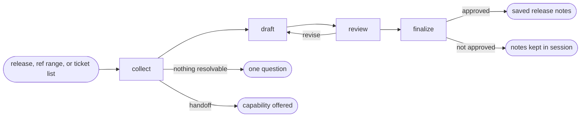

# Release Notes

## Actions

Run the flow above. Read only the next action file.

| Action   | Does                                            |
| -------- | ----------------------------------------------- |
| collect  | gather the release facts into one fact sheet    |
| draft    | write the notes for each audience from the facts |
| review   | challenge every claim and what goes public      |
| finalize | save the approved notes                          |

## Transversal rules

- Never invent a feature, metric, date, or user; mark every gap instead.
- Every item in the notes traces to a ticket, pull request, or commit.
- Derive every audience variant from the same fact sheet.
- Read the repository and the ticketing tool; never write to either.
- Keep wording and publication decisions with the user.
- Require explicit approval before any write; never share, send, or publish the notes.
- Ask natural questions; never expose actions, references, or unchanged state.
