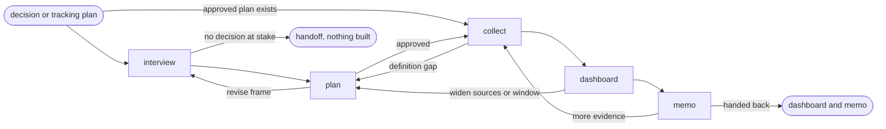

# Data-Driven Decision

## Actions

Run the flow above. Read only the next action file.

| Action    | Does                                          |
| --------- | --------------------------------------------- |
| interview | frame the decision and what would change it   |
| plan      | define topics, sources, and counting rules    |
| collect   | gather and classify matching items            |
| dashboard | count, quote, and rate confidence per topic   |
| memo      | weigh the options and hand the decision back  |

## Transversal rules

- Keep product and lifecycle decisions with the user.
- Separate evidence, decisions, and assumptions.
- Preserve source links and existing edits.
- Ask natural questions; never expose actions, references, or unchanged state.
- Require explicit approval or caller-provided bounded authority before any write.
- Collect nothing and build no dashboard before the tracking plan is approved.
- Quote only exact words read in a source; never invent, merge, or reword a quote.
- Make every count reproducible from the approved plan and the ledger.
- Say plainly when the data is too thin to conclude.
- Inform the decision; the PM makes it.
