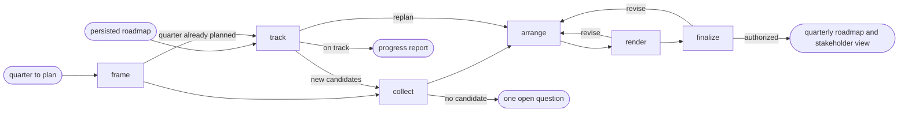

# Roadmap

## Actions

Run the flow above. Read only the next action file.

| Action   | Does                                         |
| -------- | -------------------------------------------- |
| frame    | fix the quarter, capacity, and audiences     |
| collect  | gather traced candidates and their outcomes  |
| track    | compare the roadmap with actual progress     |
| arrange  | place the items the user prioritizes         |
| render   | draw the diagram, table, and audience views  |
| finalize | approve and persist both views               |

## Transversal rules

- Keep priority, placement, and commitment decisions with the user.
- Never invent a date, priority, estimate, capacity, or commitment; ask for the missing one.
- Trace every item to its Epic, Product Brief, ticket, or decision, or mark it as a proposal.
- Separate evidence, decisions, and assumptions.
- Preserve source links and existing edits.
- Ask natural questions; never expose actions, references, or unchanged state.
- Require explicit approval or caller-provided bounded authority before any write.
- Stay at outcome level; never slice an item into Stories or tasks.
