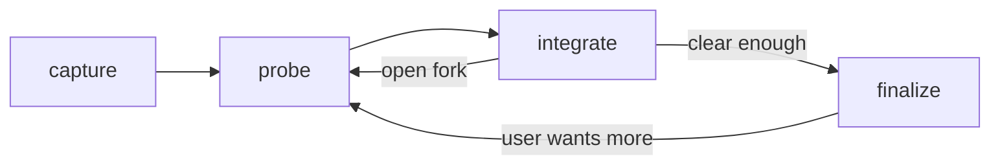

# Brainstorm

## Actions

Run the flow above. Read only the next action's file before running it.

| Action | Does |
| ------ | ---- |
| capture | restate the idea and pick what matters next |
| probe | ask the next useful questions |
| integrate | fold answers and decide whether to continue |
| finalize | produce the approved refined idea |

## Transversal rules

- Clarify intent, never plan, build, or code.
- Ask only questions that can change what gets built.
- Flag assumptions as assumptions.
- State a leaning and its tradeoff when facts already point one way.
- Hide process words: no density, coverage, nodes, completeness, matrix, or frame unless the user asks for an audit.
- Wait after questions, approval, and persistence choices.
