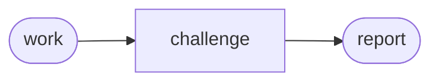

# Challenge

```mermaid
flowchart LR
  Work([work]) --> challenge --> Report([report])
```

## Actions

Read the next action file.

| Action | Does |
| --- | --- |
| challenge | challenge intent, contracts, and unnecessary complexity |
