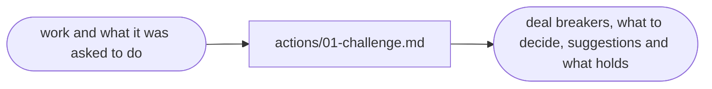

# Challenge

```mermaid
flowchart LR
  work([work and what it was asked to do]) --> challenge["actions/01-challenge.md"]
  challenge --> report([deal breakers, what to decide, suggestions and what holds])
```

## Transversal rules

- Attack the work as an adversary would, never as its author.
- Report only what changes a decision, and nothing found is a valid answer.
